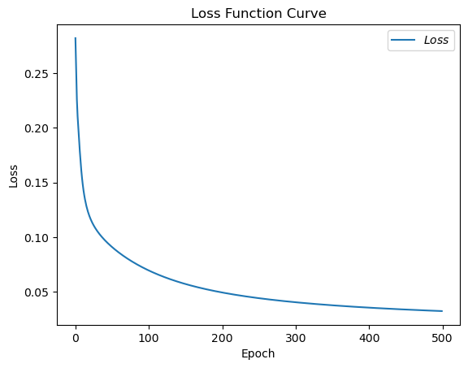
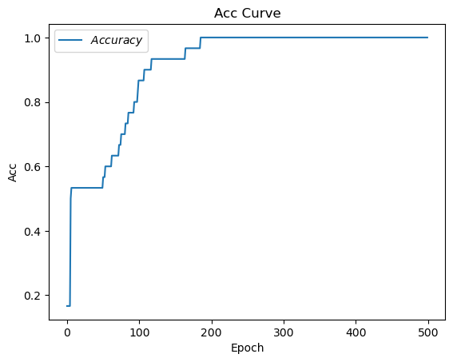

# 神经网络实现鸢尾花分类
- 数据准备
    - 读取数据集
    - 数据集打乱顺序
    - 生成训练集和测试集
    - 配成（输入特征，标签）对，每次读入一部分
- 搭建网络
    - 定义神经网络中所有的可训练参数
- 参数优化
    - 嵌套循环迭代，with结构跟新参数，计算损失函数
- 测试效果
    - 测试集准确率，显示当前accuracy
- acc/loss曲线可视化

### 利用鸢尾花数据集，实现前向传播和反向传播，可视化loss曲线


```python
# 导入所需模块
import tensorflow as tf
import numpy as np
from sklearn import datasets
import matplotlib.pyplot as plt

# 加载数据集 ,分别为输入特征和标签
x_data = datasets.load_iris().data
y_data = datasets.load_iris().target

print(f'x_data.shape:{x_data.shape}')
print(f'y_data.shape:{y_data.shape}')
```

    x_data.shape:(150, 4)
    y_data.shape:(150,)


```python
# 随机打乱数据的顺序，确保随机性，不打乱会影响准确率
# seed: 随机种子数，是一个整数，当设置后，每次生成的随机数都一样，方便复现
np.random.seed(seed=116)
np.random.shuffle(x_data)
np.random.seed(116)
np.random.shuffle(y_data)
tf.random.set_seed(116)
```


```python
# 将打乱后的数据集分割为训练集和验证集 ，训练集为前120行，测试集为后30行
x_train = x_data[:-30]
y_train = y_data[:-30]
x_test = x_data[-30:]
y_test = y_data[-30:]

# 转化x的数据类型，确保矩阵相乘时不会因数据类型不同而报错
x_train = tf.cast(x_train, tf.float32)
x_test = tf.cast(x_test, tf.float32)

# 使用from_tensor_slices函数时输入特征和标签值一一对应。（把数据集分批次，每个批次为batch组数据）
train_db = tf.data.Dataset.from_tensor_slices((x_train, y_train)).batch(32)
test_db = tf.data.Dataset.from_tensor_slices((x_test, y_test)).batch(32)
```


```python
# 生成神经网络的参数，4个输入特征吗，输入层为4个输入节点; 因为结果只有3个，所以输出层为3个神经元
# 用tf.Variable()标记参数可训练
# 是用seed使每次生成的随机数相同，方便调试（实际开发不需要）
w1 = tf.Variable(tf.random.truncated_normal([4, 3], stddev=0.1, seed=1))
b1 = tf.Variable(tf.random.truncated_normal([3], stddev=0.1, seed=1))

print(f'w1 = {w1.numpy()}, w1.shape = {w1.shape}')
print(f'b1 = {b1.numpy()}, b1.shape = {b1.shape}')
```

    w1 = [[ 0.08249953 -0.0683137   0.19668601]
     [-0.05480815  0.04570521  0.1357149 ]
     [ 0.07750896 -0.16734955 -0.10294553]
     [ 0.15784004 -0.13311003  0.06045313]], w1.shape = (4, 3)
    b1 = [-0.09194934 -0.12376948 -0.05381497], b1.shape = (3,)


w1 的形状为 [4, 3]，因为：
1.	输入层有 4 个节点（输入特征数为 4）。
2.	输出层有 3 个节点（输出神经元数为 3）。
3.	权重矩阵的形状为 [输入节点数, 输出节点数]，以满足矩阵乘法规则。

b1 的形状为 [3]，因为每个输出神经元需要一个偏置，对应输出层的 3 个节点。


```python
# 学习率
lr = 0.1 
# 将每轮的loss记录在此列表中，为后续画loss曲线做准备
train_loss_results = []
# 将每轮的acc记录在此列表中，为后续画acc曲线做准备
test_acc = []
# 训练次数
epoch = 500
# 每轮分为4个，loss_all记录四个step生成的4个loss的和
loss_all = 0
```


```python
# 训练部分
# 数据集级别的循环，每个eopch循环一次数据集
for epoch in range(epoch):
    # btach级别的循环，每个step循环一次batch
    for step, (x_train, y_train) in enumerate(train_db):
        # with 结构记录梯度信息
        with tf.GradientTape() as tape:
            # 神经网络乘加运算
            y = tf.matmul(x_train, w1) + b1
            # 使输出y符合概率分布（此操作后与独热码同量级，可相减计算loss）
            y = tf.nn.softmax(y)
            # 将标签值转为独热码格式，方便计算loss和accuracy
            y_ = tf.one_hot(y_train, depth=3)
            # 采用均方误差损失环视mse = mean(sum(y-out)^2)
            loss =tf.reduce_mean(tf.square(y_ - y))
            # 将每个step的loss累加起来，为后续求平均值做准备，这样计算的loss更准确
            loss_all += loss.numpy()
        # 计算loss对w1和b1的梯度
        grads = tape.gradient(loss, [w1, b1])
        
        # 实现梯度下降更新参数
        # w1 = w1 - lr * w1_grad b = b - lr * b_grad
        # 参数w1自更新
        w1.assign_sub(lr * grads[0])
        # 参数b1自更新
        b1.assign_sub(lr * grads[1])
        
    # 每个epoch循环完一次数据集，输出loss信息
    # print('Epoch {}, loss {}'.format(epoch, loss_all/4))
    # 将4个step的loss求平均记录到train_loss_resultsz中
    train_loss_results.append(loss_all/4)
    # 将loss归零，为下一次循环做准备
    loss_all = 0
    
    # 测试部分
    # total_correct为预测对的样本数量，total_number为测试的总样本数
    total_correct, total_number = 0, 0
    for x_test, y_test in test_db:
        # 使用更新后的参数进行预测
        y = tf.matmul(x_test, w1) + b1
        y = tf.nn.softmax(y)
        # 返回y中概率值最大的索引，即预测的类
        pred = tf.argmax(y, axis=1)
        # 将pred转为y_test的数据类型
        pred = tf.cast(pred, dtype=y_test.dtype)
        # 若分类正确，则correct为1，否则为0,将bool值转为int型
        correct = tf.cast(tf.equal(pred, y_test), dtype=tf.int32)
        
        # 将每个batch的correct求和，即得到该batch中预测对的样本数量
        correct = tf.reduce_sum(correct)
        # 将所有batch中的correct求和，即得到预测对的样本总数
        total_correct += int(correct)
        # 得到测试的总样本数,也就是x_test的行数，shape[0]返回变量的行数
        total_number += x_test.shape[0]
        
    # 总的准确率等于预测对的样本数量/测试的总样本数
    acc = total_correct / total_number
    test_acc.append(acc)
    print(f'test_acc: {acc}')
    print('-----------------------')
        
```

    epoch: 0 start
    test_acc: 1.0
    -----------------------
    epoch: 1 start
    test_acc: 1.0
    -----------------------
    epoch: 2 start
    test_acc: 1.0
    -----------------------
    epoch: 3 start
    test_acc: 1.0
    -----------------------
    epoch: 4 start
    test_acc: 1.0
    -----------------------
    epoch: 5 start
    test_acc: 1.0
    -----------------------
    epoch: 6 start
    test_acc: 1.0
    -----------------------
    epoch: 7 start
    test_acc: 1.0
    -----------------------
    epoch: 8 start
    test_acc: 1.0
    -----------------------
    epoch: 9 start
    test_acc: 1.0
    -----------------------
    epoch: 10 start
    test_acc: 1.0
    -----------------------
    epoch: 11 start
    test_acc: 1.0
    -----------------------
    epoch: 12 start
    test_acc: 1.0
    -----------------------
    epoch: 13 start
    test_acc: 1.0
    -----------------------
    epoch: 14 start
    test_acc: 1.0
    -----------------------
    epoch: 15 start
    test_acc: 1.0
    -----------------------
    epoch: 16 start
    test_acc: 1.0
    -----------------------
    epoch: 17 start
    test_acc: 1.0
    -----------------------
    epoch: 18 start
    test_acc: 1.0
    -----------------------
    epoch: 19 start
    test_acc: 1.0
    -----------------------
    epoch: 20 start
    test_acc: 1.0
    -----------------------
    epoch: 21 start
    test_acc: 1.0
    -----------------------
    epoch: 22 start
    test_acc: 1.0
    -----------------------
    epoch: 23 start
    test_acc: 1.0
    -----------------------
    epoch: 24 start
    test_acc: 1.0
    -----------------------
    epoch: 25 start
    test_acc: 1.0
    -----------------------
    epoch: 26 start
    test_acc: 1.0
    -----------------------
    epoch: 27 start
    test_acc: 1.0
    -----------------------
    epoch: 28 start
    test_acc: 1.0
    -----------------------
    epoch: 29 start
    test_acc: 1.0
    -----------------------
    epoch: 30 start
    test_acc: 1.0
    -----------------------
    epoch: 31 start
    test_acc: 1.0
    -----------------------
    epoch: 32 start
    test_acc: 1.0
    -----------------------
    epoch: 33 start
    test_acc: 1.0
    -----------------------
    epoch: 34 start
    test_acc: 1.0
    -----------------------
    epoch: 35 start
    test_acc: 1.0
    -----------------------
    epoch: 36 start
    test_acc: 1.0
    -----------------------
    epoch: 37 start
    test_acc: 1.0
    -----------------------
    epoch: 38 start
    test_acc: 1.0
    -----------------------
    epoch: 39 start
    test_acc: 1.0
    -----------------------
    epoch: 40 start
    test_acc: 1.0
    -----------------------
    epoch: 41 start
    test_acc: 1.0
    -----------------------
    epoch: 42 start
    test_acc: 1.0
    -----------------------
    epoch: 43 start
    test_acc: 1.0
    -----------------------
    epoch: 44 start
    test_acc: 1.0
    -----------------------
    epoch: 45 start
    test_acc: 1.0
    -----------------------
    epoch: 46 start
    test_acc: 1.0
    -----------------------
    epoch: 47 start
    test_acc: 1.0
    -----------------------
    epoch: 48 start
    test_acc: 1.0
    -----------------------
    epoch: 49 start
    test_acc: 1.0
    -----------------------
    epoch: 50 start
    test_acc: 1.0
    -----------------------
    epoch: 51 start
    test_acc: 1.0
    -----------------------
    epoch: 52 start
    test_acc: 1.0
    -----------------------
    epoch: 53 start
    test_acc: 1.0
    -----------------------
    epoch: 54 start
    test_acc: 1.0
    -----------------------
    epoch: 55 start
    test_acc: 1.0
    -----------------------
    epoch: 56 start
    test_acc: 1.0
    -----------------------
    epoch: 57 start
    test_acc: 1.0
    -----------------------
    epoch: 58 start
    test_acc: 1.0
    -----------------------
    epoch: 59 start
    test_acc: 1.0
    -----------------------
    epoch: 60 start
    test_acc: 1.0
    -----------------------
    epoch: 61 start
    test_acc: 1.0
    -----------------------
    epoch: 62 start
    test_acc: 1.0
    -----------------------
    epoch: 63 start
    test_acc: 1.0
    -----------------------
    epoch: 64 start
    test_acc: 1.0
    -----------------------
    epoch: 65 start
    test_acc: 1.0
    -----------------------
    epoch: 66 start
    test_acc: 1.0
    -----------------------
    epoch: 67 start
    test_acc: 1.0
    -----------------------
    epoch: 68 start
    test_acc: 1.0
    -----------------------
    epoch: 69 start
    test_acc: 1.0
    -----------------------
    epoch: 70 start
    test_acc: 1.0
    -----------------------
    epoch: 71 start
    test_acc: 1.0
    -----------------------
    epoch: 72 start
    test_acc: 1.0
    -----------------------
    epoch: 73 start
    test_acc: 1.0
    -----------------------
    epoch: 74 start
    test_acc: 1.0
    -----------------------
    epoch: 75 start
    test_acc: 1.0
    -----------------------
    epoch: 76 start
    test_acc: 1.0
    -----------------------
    epoch: 77 start
    test_acc: 1.0
    -----------------------
    epoch: 78 start
    test_acc: 1.0
    -----------------------
    epoch: 79 start
    test_acc: 1.0
    -----------------------
    epoch: 80 start
    test_acc: 1.0
    -----------------------
    epoch: 81 start
    test_acc: 1.0
    -----------------------
    epoch: 82 start
    test_acc: 1.0
    -----------------------
    epoch: 83 start
    test_acc: 1.0
    -----------------------
    epoch: 84 start
    test_acc: 1.0
    -----------------------
    epoch: 85 start
    test_acc: 1.0
    -----------------------
    epoch: 86 start
    test_acc: 1.0
    -----------------------
    epoch: 87 start
    test_acc: 1.0
    -----------------------
    epoch: 88 start
    test_acc: 1.0
    -----------------------
    epoch: 89 start
    test_acc: 1.0
    -----------------------
    epoch: 90 start
    test_acc: 1.0
    -----------------------
    epoch: 91 start
    test_acc: 1.0
    -----------------------
    epoch: 92 start
    test_acc: 1.0
    -----------------------
    epoch: 93 start
    test_acc: 1.0
    -----------------------
    epoch: 94 start
    test_acc: 1.0
    -----------------------
    epoch: 95 start
    test_acc: 1.0
    -----------------------
    epoch: 96 start
    test_acc: 1.0
    -----------------------
    epoch: 97 start
    test_acc: 1.0
    -----------------------
    epoch: 98 start
    test_acc: 1.0
    -----------------------
    epoch: 99 start
    test_acc: 1.0
    -----------------------
    epoch: 100 start
    test_acc: 1.0
    -----------------------
    epoch: 101 start
    test_acc: 1.0
    -----------------------
    epoch: 102 start
    test_acc: 1.0
    -----------------------
    epoch: 103 start
    test_acc: 1.0
    -----------------------
    epoch: 104 start
    test_acc: 1.0
    -----------------------
    epoch: 105 start
    test_acc: 1.0
    -----------------------
    epoch: 106 start
    test_acc: 1.0
    -----------------------
    epoch: 107 start
    test_acc: 1.0
    -----------------------
    epoch: 108 start
    test_acc: 1.0
    -----------------------
    epoch: 109 start
    test_acc: 1.0
    -----------------------
    epoch: 110 start
    test_acc: 1.0
    -----------------------
    epoch: 111 start
    test_acc: 1.0
    -----------------------
    epoch: 112 start
    test_acc: 1.0
    -----------------------
    epoch: 113 start
    test_acc: 1.0
    -----------------------
    epoch: 114 start
    test_acc: 1.0
    -----------------------
    epoch: 115 start
    test_acc: 1.0
    -----------------------
    epoch: 116 start
    test_acc: 1.0
    -----------------------
    epoch: 117 start
    test_acc: 1.0
    -----------------------
    epoch: 118 start
    test_acc: 1.0
    -----------------------
    epoch: 119 start
    test_acc: 1.0
    -----------------------
    epoch: 120 start
    test_acc: 1.0
    -----------------------
    epoch: 121 start
    test_acc: 1.0
    -----------------------
    epoch: 122 start
    test_acc: 1.0
    -----------------------
    epoch: 123 start
    test_acc: 1.0
    -----------------------
    epoch: 124 start
    test_acc: 1.0
    -----------------------
    epoch: 125 start
    test_acc: 1.0
    -----------------------
    epoch: 126 start
    test_acc: 1.0
    -----------------------
    epoch: 127 start
    test_acc: 1.0
    -----------------------
    epoch: 128 start
    test_acc: 1.0
    -----------------------
    epoch: 129 start
    test_acc: 1.0
    -----------------------
    epoch: 130 start
    test_acc: 1.0
    -----------------------
    epoch: 131 start
    test_acc: 1.0
    -----------------------
    epoch: 132 start
    test_acc: 1.0
    -----------------------
    epoch: 133 start
    test_acc: 1.0
    -----------------------
    epoch: 134 start
    test_acc: 1.0
    -----------------------
    epoch: 135 start
    test_acc: 1.0
    -----------------------
    epoch: 136 start
    test_acc: 1.0
    -----------------------
    epoch: 137 start
    test_acc: 1.0
    -----------------------
    epoch: 138 start
    test_acc: 1.0
    -----------------------
    epoch: 139 start
    test_acc: 1.0
    -----------------------
    epoch: 140 start
    test_acc: 1.0
    -----------------------
    epoch: 141 start
    test_acc: 1.0
    -----------------------
    epoch: 142 start
    test_acc: 1.0
    -----------------------
    epoch: 143 start
    test_acc: 1.0
    -----------------------
    epoch: 144 start
    test_acc: 1.0
    -----------------------
    epoch: 145 start
    test_acc: 1.0
    -----------------------
    epoch: 146 start
    test_acc: 1.0
    -----------------------
    epoch: 147 start
    test_acc: 1.0
    -----------------------
    epoch: 148 start
    test_acc: 1.0
    -----------------------
    epoch: 149 start
    test_acc: 1.0
    -----------------------
    epoch: 150 start
    test_acc: 1.0
    -----------------------
    epoch: 151 start
    test_acc: 1.0
    -----------------------
    epoch: 152 start
    test_acc: 1.0
    -----------------------
    epoch: 153 start
    test_acc: 1.0
    -----------------------
    epoch: 154 start
    test_acc: 1.0
    -----------------------
    epoch: 155 start
    test_acc: 1.0
    -----------------------
    epoch: 156 start
    test_acc: 1.0
    -----------------------
    epoch: 157 start
    test_acc: 1.0
    -----------------------
    epoch: 158 start
    test_acc: 1.0
    -----------------------
    epoch: 159 start
    test_acc: 1.0
    -----------------------
    epoch: 160 start
    test_acc: 1.0
    -----------------------
    epoch: 161 start
    test_acc: 1.0
    -----------------------
    epoch: 162 start
    test_acc: 1.0
    -----------------------
    epoch: 163 start
    test_acc: 1.0
    -----------------------
    epoch: 164 start
    test_acc: 1.0
    -----------------------
    epoch: 165 start
    test_acc: 1.0
    -----------------------
    epoch: 166 start
    test_acc: 1.0
    -----------------------
    epoch: 167 start
    test_acc: 1.0
    -----------------------
    epoch: 168 start
    test_acc: 1.0
    -----------------------
    epoch: 169 start
    test_acc: 1.0
    -----------------------
    epoch: 170 start
    test_acc: 1.0
    -----------------------
    epoch: 171 start
    test_acc: 1.0
    -----------------------
    epoch: 172 start
    test_acc: 1.0
    -----------------------
    epoch: 173 start
    test_acc: 1.0
    -----------------------
    epoch: 174 start
    test_acc: 1.0
    -----------------------
    epoch: 175 start
    test_acc: 1.0
    -----------------------
    epoch: 176 start
    test_acc: 1.0
    -----------------------
    epoch: 177 start
    test_acc: 1.0
    -----------------------
    epoch: 178 start
    test_acc: 1.0
    -----------------------
    epoch: 179 start
    test_acc: 1.0
    -----------------------
    epoch: 180 start
    test_acc: 1.0
    -----------------------
    epoch: 181 start
    test_acc: 1.0
    -----------------------
    epoch: 182 start
    test_acc: 1.0
    -----------------------
    epoch: 183 start
    test_acc: 1.0
    -----------------------
    epoch: 184 start
    test_acc: 1.0
    -----------------------
    epoch: 185 start
    test_acc: 1.0
    -----------------------
    epoch: 186 start
    test_acc: 1.0
    -----------------------
    epoch: 187 start
    test_acc: 1.0
    -----------------------
    epoch: 188 start
    test_acc: 1.0
    -----------------------
    epoch: 189 start
    test_acc: 1.0
    -----------------------
    epoch: 190 start
    test_acc: 1.0
    -----------------------
    epoch: 191 start
    test_acc: 1.0
    -----------------------
    epoch: 192 start
    test_acc: 1.0
    -----------------------
    epoch: 193 start
    test_acc: 1.0
    -----------------------
    epoch: 194 start
    test_acc: 1.0
    -----------------------
    epoch: 195 start
    test_acc: 1.0
    -----------------------
    epoch: 196 start
    test_acc: 1.0
    -----------------------
    epoch: 197 start
    test_acc: 1.0
    -----------------------
    epoch: 198 start
    test_acc: 1.0
    -----------------------
    epoch: 199 start
    test_acc: 1.0
    -----------------------
    epoch: 200 start
    test_acc: 1.0
    -----------------------
    epoch: 201 start
    test_acc: 1.0
    -----------------------
    epoch: 202 start
    test_acc: 1.0
    -----------------------
    epoch: 203 start
    test_acc: 1.0
    -----------------------
    epoch: 204 start
    test_acc: 1.0
    -----------------------
    epoch: 205 start
    test_acc: 1.0
    -----------------------
    epoch: 206 start
    test_acc: 1.0
    -----------------------
    epoch: 207 start
    test_acc: 1.0
    -----------------------
    epoch: 208 start
    test_acc: 1.0
    -----------------------
    epoch: 209 start
    test_acc: 1.0
    -----------------------
    epoch: 210 start
    test_acc: 1.0
    -----------------------
    epoch: 211 start
    test_acc: 1.0
    -----------------------
    epoch: 212 start
    test_acc: 1.0
    -----------------------
    epoch: 213 start
    test_acc: 1.0
    -----------------------
    epoch: 214 start
    test_acc: 1.0
    -----------------------
    epoch: 215 start
    test_acc: 1.0
    -----------------------
    epoch: 216 start
    test_acc: 1.0
    -----------------------
    epoch: 217 start
    test_acc: 1.0
    -----------------------
    epoch: 218 start
    test_acc: 1.0
    -----------------------
    epoch: 219 start
    test_acc: 1.0
    -----------------------
    epoch: 220 start
    test_acc: 1.0
    -----------------------
    epoch: 221 start
    test_acc: 1.0
    -----------------------
    epoch: 222 start
    test_acc: 1.0
    -----------------------
    epoch: 223 start
    test_acc: 1.0
    -----------------------
    epoch: 224 start
    test_acc: 1.0
    -----------------------
    epoch: 225 start
    test_acc: 1.0
    -----------------------
    epoch: 226 start
    test_acc: 1.0
    -----------------------
    epoch: 227 start
    test_acc: 1.0
    -----------------------
    epoch: 228 start
    test_acc: 1.0
    -----------------------
    epoch: 229 start
    test_acc: 1.0
    -----------------------
    epoch: 230 start
    test_acc: 1.0
    -----------------------
    epoch: 231 start
    test_acc: 1.0
    -----------------------
    epoch: 232 start
    test_acc: 1.0
    -----------------------
    epoch: 233 start
    test_acc: 1.0
    -----------------------
    epoch: 234 start
    test_acc: 1.0
    -----------------------
    epoch: 235 start
    test_acc: 1.0
    -----------------------
    epoch: 236 start
    test_acc: 1.0
    -----------------------
    epoch: 237 start
    test_acc: 1.0
    -----------------------
    epoch: 238 start
    test_acc: 1.0
    -----------------------
    epoch: 239 start
    test_acc: 1.0
    -----------------------
    epoch: 240 start
    test_acc: 1.0
    -----------------------
    epoch: 241 start
    test_acc: 1.0
    -----------------------
    epoch: 242 start
    test_acc: 1.0
    -----------------------
    epoch: 243 start
    test_acc: 1.0
    -----------------------
    epoch: 244 start
    test_acc: 1.0
    -----------------------
    epoch: 245 start
    test_acc: 1.0
    -----------------------
    epoch: 246 start
    test_acc: 1.0
    -----------------------
    epoch: 247 start
    test_acc: 1.0
    -----------------------
    epoch: 248 start
    test_acc: 1.0
    -----------------------
    epoch: 249 start
    test_acc: 1.0
    -----------------------
    epoch: 250 start
    test_acc: 1.0
    -----------------------
    epoch: 251 start
    test_acc: 1.0
    -----------------------
    epoch: 252 start
    test_acc: 1.0
    -----------------------
    epoch: 253 start
    test_acc: 1.0
    -----------------------
    epoch: 254 start
    test_acc: 1.0
    -----------------------
    epoch: 255 start
    test_acc: 1.0
    -----------------------
    epoch: 256 start
    test_acc: 1.0
    -----------------------
    epoch: 257 start
    test_acc: 1.0
    -----------------------
    epoch: 258 start
    test_acc: 1.0
    -----------------------
    epoch: 259 start
    test_acc: 1.0
    -----------------------
    epoch: 260 start
    test_acc: 1.0
    -----------------------
    epoch: 261 start
    test_acc: 1.0
    -----------------------
    epoch: 262 start
    test_acc: 1.0
    -----------------------
    epoch: 263 start
    test_acc: 1.0
    -----------------------
    epoch: 264 start
    test_acc: 1.0
    -----------------------
    epoch: 265 start
    test_acc: 1.0
    -----------------------
    epoch: 266 start
    test_acc: 1.0
    -----------------------
    epoch: 267 start
    test_acc: 1.0
    -----------------------
    epoch: 268 start
    test_acc: 1.0
    -----------------------
    epoch: 269 start
    test_acc: 1.0
    -----------------------
    epoch: 270 start
    test_acc: 1.0
    -----------------------
    epoch: 271 start
    test_acc: 1.0
    -----------------------
    epoch: 272 start
    test_acc: 1.0
    -----------------------
    epoch: 273 start
    test_acc: 1.0
    -----------------------
    epoch: 274 start
    test_acc: 1.0
    -----------------------
    epoch: 275 start
    test_acc: 1.0
    -----------------------
    epoch: 276 start
    test_acc: 1.0
    -----------------------
    epoch: 277 start
    test_acc: 1.0
    -----------------------
    epoch: 278 start
    test_acc: 1.0
    -----------------------
    epoch: 279 start
    test_acc: 1.0
    -----------------------
    epoch: 280 start
    test_acc: 1.0
    -----------------------
    epoch: 281 start
    test_acc: 1.0
    -----------------------
    epoch: 282 start
    test_acc: 1.0
    -----------------------
    epoch: 283 start
    test_acc: 1.0
    -----------------------
    epoch: 284 start
    test_acc: 1.0
    -----------------------
    epoch: 285 start
    test_acc: 1.0
    -----------------------
    epoch: 286 start
    test_acc: 1.0
    -----------------------
    epoch: 287 start
    test_acc: 1.0
    -----------------------
    epoch: 288 start
    test_acc: 1.0
    -----------------------
    epoch: 289 start
    test_acc: 1.0
    -----------------------
    epoch: 290 start
    test_acc: 1.0
    -----------------------
    epoch: 291 start
    test_acc: 1.0
    -----------------------
    epoch: 292 start
    test_acc: 1.0
    -----------------------
    epoch: 293 start
    test_acc: 1.0
    -----------------------
    epoch: 294 start
    test_acc: 1.0
    -----------------------
    epoch: 295 start
    test_acc: 1.0
    -----------------------
    epoch: 296 start
    test_acc: 1.0
    -----------------------
    epoch: 297 start
    test_acc: 1.0
    -----------------------
    epoch: 298 start
    test_acc: 1.0
    -----------------------
    epoch: 299 start
    test_acc: 1.0
    -----------------------
    epoch: 300 start
    test_acc: 1.0
    -----------------------
    epoch: 301 start
    test_acc: 1.0
    -----------------------
    epoch: 302 start
    test_acc: 1.0
    -----------------------
    epoch: 303 start
    test_acc: 1.0
    -----------------------
    epoch: 304 start
    test_acc: 1.0
    -----------------------
    epoch: 305 start
    test_acc: 1.0
    -----------------------
    epoch: 306 start
    test_acc: 1.0
    -----------------------
    epoch: 307 start
    test_acc: 1.0
    -----------------------
    epoch: 308 start
    test_acc: 1.0
    -----------------------
    epoch: 309 start
    test_acc: 1.0
    -----------------------
    epoch: 310 start
    test_acc: 1.0
    -----------------------
    epoch: 311 start
    test_acc: 1.0
    -----------------------
    epoch: 312 start
    test_acc: 1.0
    -----------------------
    epoch: 313 start
    test_acc: 1.0
    -----------------------
    epoch: 314 start
    test_acc: 1.0
    -----------------------
    epoch: 315 start
    test_acc: 1.0
    -----------------------
    epoch: 316 start
    test_acc: 1.0
    -----------------------
    epoch: 317 start
    test_acc: 1.0
    -----------------------
    epoch: 318 start
    test_acc: 1.0
    -----------------------
    epoch: 319 start
    test_acc: 1.0
    -----------------------
    epoch: 320 start
    test_acc: 1.0
    -----------------------
    epoch: 321 start
    test_acc: 1.0
    -----------------------
    epoch: 322 start
    test_acc: 1.0
    -----------------------
    epoch: 323 start
    test_acc: 1.0
    -----------------------
    epoch: 324 start
    test_acc: 1.0
    -----------------------
    epoch: 325 start
    test_acc: 1.0
    -----------------------
    epoch: 326 start
    test_acc: 1.0
    -----------------------
    epoch: 327 start
    test_acc: 1.0
    -----------------------
    epoch: 328 start
    test_acc: 1.0
    -----------------------
    epoch: 329 start
    test_acc: 1.0
    -----------------------
    epoch: 330 start
    test_acc: 1.0
    -----------------------
    epoch: 331 start
    test_acc: 1.0
    -----------------------
    epoch: 332 start
    test_acc: 1.0
    -----------------------
    epoch: 333 start
    test_acc: 1.0
    -----------------------
    epoch: 334 start
    test_acc: 1.0
    -----------------------
    epoch: 335 start
    test_acc: 1.0
    -----------------------
    epoch: 336 start
    test_acc: 1.0
    -----------------------
    epoch: 337 start
    test_acc: 1.0
    -----------------------
    epoch: 338 start
    test_acc: 1.0
    -----------------------
    epoch: 339 start
    test_acc: 1.0
    -----------------------
    epoch: 340 start
    test_acc: 1.0
    -----------------------
    epoch: 341 start
    test_acc: 1.0
    -----------------------
    epoch: 342 start
    test_acc: 1.0
    -----------------------
    epoch: 343 start
    test_acc: 1.0
    -----------------------
    epoch: 344 start
    test_acc: 1.0
    -----------------------
    epoch: 345 start
    test_acc: 1.0
    -----------------------
    epoch: 346 start
    test_acc: 1.0
    -----------------------
    epoch: 347 start
    test_acc: 1.0
    -----------------------
    epoch: 348 start
    test_acc: 1.0
    -----------------------
    epoch: 349 start
    test_acc: 1.0
    -----------------------
    epoch: 350 start
    test_acc: 1.0
    -----------------------
    epoch: 351 start
    test_acc: 1.0
    -----------------------
    epoch: 352 start
    test_acc: 1.0
    -----------------------
    epoch: 353 start
    test_acc: 1.0
    -----------------------
    epoch: 354 start
    test_acc: 1.0
    -----------------------
    epoch: 355 start
    test_acc: 1.0
    -----------------------
    epoch: 356 start
    test_acc: 1.0
    -----------------------
    epoch: 357 start
    test_acc: 1.0
    -----------------------
    epoch: 358 start
    test_acc: 1.0
    -----------------------
    epoch: 359 start
    test_acc: 1.0
    -----------------------
    epoch: 360 start
    test_acc: 1.0
    -----------------------
    epoch: 361 start
    test_acc: 1.0
    -----------------------
    epoch: 362 start
    test_acc: 1.0
    -----------------------
    epoch: 363 start
    test_acc: 1.0
    -----------------------
    epoch: 364 start
    test_acc: 1.0
    -----------------------
    epoch: 365 start
    test_acc: 1.0
    -----------------------
    epoch: 366 start
    test_acc: 1.0
    -----------------------
    epoch: 367 start
    test_acc: 1.0
    -----------------------
    epoch: 368 start
    test_acc: 1.0
    -----------------------
    epoch: 369 start
    test_acc: 1.0
    -----------------------
    epoch: 370 start
    test_acc: 1.0
    -----------------------
    epoch: 371 start
    test_acc: 1.0
    -----------------------
    epoch: 372 start
    test_acc: 1.0
    -----------------------
    epoch: 373 start
    test_acc: 1.0
    -----------------------
    epoch: 374 start
    test_acc: 1.0
    -----------------------
    epoch: 375 start
    test_acc: 1.0
    -----------------------
    epoch: 376 start
    test_acc: 1.0
    -----------------------
    epoch: 377 start
    test_acc: 1.0
    -----------------------
    epoch: 378 start
    test_acc: 1.0
    -----------------------
    epoch: 379 start
    test_acc: 1.0
    -----------------------
    epoch: 380 start
    test_acc: 1.0
    -----------------------
    epoch: 381 start
    test_acc: 1.0
    -----------------------
    epoch: 382 start
    test_acc: 1.0
    -----------------------
    epoch: 383 start
    test_acc: 1.0
    -----------------------
    epoch: 384 start
    test_acc: 1.0
    -----------------------
    epoch: 385 start
    test_acc: 1.0
    -----------------------
    epoch: 386 start
    test_acc: 1.0
    -----------------------
    epoch: 387 start
    test_acc: 1.0
    -----------------------
    epoch: 388 start
    test_acc: 1.0
    -----------------------
    epoch: 389 start
    test_acc: 1.0
    -----------------------
    epoch: 390 start
    test_acc: 1.0
    -----------------------
    epoch: 391 start
    test_acc: 1.0
    -----------------------
    epoch: 392 start
    test_acc: 1.0
    -----------------------
    epoch: 393 start
    test_acc: 1.0
    -----------------------
    epoch: 394 start
    test_acc: 1.0
    -----------------------
    epoch: 395 start
    test_acc: 1.0
    -----------------------
    epoch: 396 start
    test_acc: 1.0
    -----------------------
    epoch: 397 start
    test_acc: 1.0
    -----------------------
    epoch: 398 start
    test_acc: 1.0
    -----------------------
    epoch: 399 start
    test_acc: 1.0
    -----------------------
    epoch: 400 start
    test_acc: 1.0
    -----------------------
    epoch: 401 start
    test_acc: 1.0
    -----------------------
    epoch: 402 start
    test_acc: 1.0
    -----------------------
    epoch: 403 start
    test_acc: 1.0
    -----------------------
    epoch: 404 start
    test_acc: 1.0
    -----------------------
    epoch: 405 start
    test_acc: 1.0
    -----------------------
    epoch: 406 start
    test_acc: 1.0
    -----------------------
    epoch: 407 start
    test_acc: 1.0
    -----------------------
    epoch: 408 start
    test_acc: 1.0
    -----------------------
    epoch: 409 start
    test_acc: 1.0
    -----------------------
    epoch: 410 start
    test_acc: 1.0
    -----------------------
    epoch: 411 start
    test_acc: 1.0
    -----------------------
    epoch: 412 start
    test_acc: 1.0
    -----------------------
    epoch: 413 start
    test_acc: 1.0
    -----------------------
    epoch: 414 start
    test_acc: 1.0
    -----------------------
    epoch: 415 start
    test_acc: 1.0
    -----------------------
    epoch: 416 start
    test_acc: 1.0
    -----------------------
    epoch: 417 start
    test_acc: 1.0
    -----------------------
    epoch: 418 start
    test_acc: 1.0
    -----------------------
    epoch: 419 start
    test_acc: 1.0
    -----------------------
    epoch: 420 start
    test_acc: 1.0
    -----------------------
    epoch: 421 start
    test_acc: 1.0
    -----------------------
    epoch: 422 start
    test_acc: 1.0
    -----------------------
    epoch: 423 start
    test_acc: 1.0
    -----------------------
    epoch: 424 start
    test_acc: 1.0
    -----------------------
    epoch: 425 start
    test_acc: 1.0
    -----------------------
    epoch: 426 start
    test_acc: 1.0
    -----------------------
    epoch: 427 start
    test_acc: 1.0
    -----------------------
    epoch: 428 start
    test_acc: 1.0
    -----------------------
    epoch: 429 start
    test_acc: 1.0
    -----------------------
    epoch: 430 start
    test_acc: 1.0
    -----------------------
    epoch: 431 start
    test_acc: 1.0
    -----------------------
    epoch: 432 start
    test_acc: 1.0
    -----------------------
    epoch: 433 start
    test_acc: 1.0
    -----------------------
    epoch: 434 start
    test_acc: 1.0
    -----------------------
    epoch: 435 start
    test_acc: 1.0
    -----------------------
    epoch: 436 start
    test_acc: 1.0
    -----------------------
    epoch: 437 start
    test_acc: 1.0
    -----------------------
    epoch: 438 start
    test_acc: 1.0
    -----------------------
    epoch: 439 start
    test_acc: 1.0
    -----------------------
    epoch: 440 start
    test_acc: 1.0
    -----------------------
    epoch: 441 start
    test_acc: 1.0
    -----------------------
    epoch: 442 start
    test_acc: 1.0
    -----------------------
    epoch: 443 start
    test_acc: 1.0
    -----------------------
    epoch: 444 start
    test_acc: 1.0
    -----------------------
    epoch: 445 start
    test_acc: 1.0
    -----------------------
    epoch: 446 start
    test_acc: 1.0
    -----------------------
    epoch: 447 start
    test_acc: 1.0
    -----------------------
    epoch: 448 start
    test_acc: 1.0
    -----------------------
    epoch: 449 start
    test_acc: 1.0
    -----------------------
    epoch: 450 start
    test_acc: 1.0
    -----------------------
    epoch: 451 start
    test_acc: 1.0
    -----------------------
    epoch: 452 start
    test_acc: 1.0
    -----------------------
    epoch: 453 start
    test_acc: 1.0
    -----------------------
    epoch: 454 start
    test_acc: 1.0
    -----------------------
    epoch: 455 start
    test_acc: 1.0
    -----------------------
    epoch: 456 start
    test_acc: 1.0
    -----------------------
    epoch: 457 start
    test_acc: 1.0
    -----------------------
    epoch: 458 start
    test_acc: 1.0
    -----------------------
    epoch: 459 start
    test_acc: 1.0
    -----------------------
    epoch: 460 start
    test_acc: 1.0
    -----------------------
    epoch: 461 start
    test_acc: 1.0
    -----------------------
    epoch: 462 start
    test_acc: 1.0
    -----------------------
    epoch: 463 start
    test_acc: 1.0
    -----------------------
    epoch: 464 start
    test_acc: 1.0
    -----------------------
    epoch: 465 start
    test_acc: 1.0
    -----------------------
    epoch: 466 start
    test_acc: 1.0
    -----------------------
    epoch: 467 start
    test_acc: 1.0
    -----------------------
    epoch: 468 start
    test_acc: 1.0
    -----------------------
    epoch: 469 start
    test_acc: 1.0
    -----------------------
    epoch: 470 start
    test_acc: 1.0
    -----------------------
    epoch: 471 start
    test_acc: 1.0
    -----------------------
    epoch: 472 start
    test_acc: 1.0
    -----------------------
    epoch: 473 start
    test_acc: 1.0
    -----------------------
    epoch: 474 start
    test_acc: 1.0
    -----------------------
    epoch: 475 start
    test_acc: 1.0
    -----------------------
    epoch: 476 start
    test_acc: 1.0
    -----------------------
    epoch: 477 start
    test_acc: 1.0
    -----------------------
    epoch: 478 start
    test_acc: 1.0
    -----------------------
    epoch: 479 start
    test_acc: 1.0
    -----------------------
    epoch: 480 start
    test_acc: 1.0
    -----------------------
    epoch: 481 start
    test_acc: 1.0
    -----------------------
    epoch: 482 start
    test_acc: 1.0
    -----------------------
    epoch: 483 start
    test_acc: 1.0
    -----------------------
    epoch: 484 start
    test_acc: 1.0
    -----------------------
    epoch: 485 start
    test_acc: 1.0
    -----------------------
    epoch: 486 start
    test_acc: 1.0
    -----------------------
    epoch: 487 start
    test_acc: 1.0
    -----------------------
    epoch: 488 start
    test_acc: 1.0
    -----------------------
    epoch: 489 start
    test_acc: 1.0
    -----------------------
    epoch: 490 start
    test_acc: 1.0
    -----------------------
    epoch: 491 start
    test_acc: 1.0
    -----------------------
    epoch: 492 start
    test_acc: 1.0
    -----------------------
    epoch: 493 start
    test_acc: 1.0
    -----------------------
    epoch: 494 start
    test_acc: 1.0
    -----------------------
    epoch: 495 start
    test_acc: 1.0
    -----------------------
    epoch: 496 start
    test_acc: 1.0
    -----------------------
    epoch: 497 start
    test_acc: 1.0
    -----------------------
    epoch: 498 start
    test_acc: 1.0
    -----------------------


```python
print(f'train_loss_results = {train_loss_results}')
# 绘制 loss 曲线
plt.title('Loss Function Curve')  # 图片标题
plt.xlabel('Epoch')  # x轴变量名称
plt.ylabel('Loss')  # y轴变量名称
plt.plot(train_loss_results, label="$Loss$")  # 逐点画出trian_loss_results值并连线，连线图标是Loss
plt.legend()  # 画出曲线图标
plt.show()  # 画出图像
```

    train_loss_results = [0.2821310982108116, 0.25459614023566246, 0.22570249810814857, 0.21028400212526321, 0.19942264631390572, 0.18873637914657593, 0.17851299792528152, 0.16922875866293907, 0.16107672825455666, 0.15404684841632843, 0.14802726358175278, 0.14287303760647774, 0.1384414155036211, 0.13460607640445232, 0.13126072473824024, 0.12831822223961353, 0.12570795230567455, 0.12337298691272736, 0.12126746214926243, 0.11935433000326157, 0.11760355159640312, 0.11599067784845829, 0.11449568718671799, 0.11310207657516003, 0.11179621517658234, 0.11056671850383282, 0.10940408147871494, 0.10830027982592583, 0.10724855028092861, 0.10624313354492188, 0.10527909733355045, 0.10435222461819649, 0.10345886088907719, 0.10259587690234184, 0.10176052711904049, 0.10095042549073696, 0.10016347840428352, 0.09939785115420818, 0.09865193627774715, 0.09792428463697433, 0.09721365198493004, 0.09651889652013779, 0.09583901986479759, 0.09517311118543148, 0.09452037140727043, 0.0938800759613514, 0.09325156547129154, 0.09263425506651402, 0.09202760085463524, 0.09143111854791641, 0.09084436669945717, 0.09026693738996983, 0.08969847112894058, 0.08913861028850079, 0.08858705125749111, 0.08804351091384888, 0.08750773221254349, 0.0869794450700283, 0.08645843155682087, 0.08594448864459991, 0.08543741516768932, 0.08493702299892902, 0.08444313518702984, 0.08395559899508953, 0.08347425609827042, 0.0829989779740572, 0.08252961374819279, 0.08206604234874249, 0.081608135253191, 0.08115578256547451, 0.08070887438952923, 0.08026731759309769, 0.07983099669218063, 0.07939982041716576, 0.07897369936108589, 0.07855254597961903, 0.0781362745910883, 0.07772481441497803, 0.07731806859374046, 0.07691597566008568, 0.07651845179498196, 0.07612543925642967, 0.07573685981333256, 0.07535265013575554, 0.07497274503111839, 0.07459708116948605, 0.07422559335827827, 0.07385822664946318, 0.07349491771310568, 0.0731356181204319, 0.07278026361018419, 0.07242879923433065, 0.07208118122071028, 0.07173733878880739, 0.07139723841100931, 0.07106082420796156, 0.07072804123163223, 0.0703988391906023, 0.07007317896932364, 0.0697510140016675, 0.06943229772150517, 0.06911697331815958, 0.06880500633269548, 0.06849635764956474, 0.06819095928221941, 0.06788879912346601, 0.06758982315659523, 0.0672939857468009, 0.06700124684721231, 0.06671156734228134, 0.0664249137043953, 0.06614123936742544, 0.06586051359772682, 0.06558268424123526, 0.06530773174017668, 0.06503560673445463, 0.06476627942174673, 0.06449970323592424, 0.06423586141318083, 0.06397470366209745, 0.06371619738638401, 0.06346031557768583, 0.06320702005177736, 0.06295627262443304, 0.06270804908126593, 0.06246232055127621, 0.06221904885023832, 0.06197819672524929, 0.061739739030599594, 0.06150365062057972, 0.061269890516996384, 0.06103843543678522, 0.060809265822172165, 0.060582335107028484, 0.06035762559622526, 0.06013511121273041, 0.05991475656628609, 0.05969653092324734, 0.05948041658848524, 0.05926639027893543, 0.05905441381037235, 0.05884446855634451, 0.05863653123378754, 0.058430569246411324, 0.05822656024247408, 0.05802448373287916, 0.05782431084662676, 0.057626026682555676, 0.05742960050702095, 0.05723500158637762, 0.05704221222549677, 0.05685122683644295, 0.0566619960591197, 0.05647451803088188, 0.0562887703999877, 0.05610471963882446, 0.055922347120940685, 0.055741638876497746, 0.05556256789714098, 0.05538512114435434, 0.055209274403750896, 0.055035010911524296, 0.0548623101785779, 0.054691147059202194, 0.05452151317149401, 0.0543533880263567, 0.05418673809617758, 0.05402155686169863, 0.05385784152895212, 0.053695558570325375, 0.053534683771431446, 0.05337521433830261, 0.05321712139993906, 0.053060395643115044, 0.052905027754604816, 0.05275098793208599, 0.05259826127439737, 0.05244684685021639, 0.052296712063252926, 0.052147853188216686, 0.052000255323946476, 0.05185389053076506, 0.051708764396607876, 0.051564838737249374, 0.051422121934592724, 0.05128058698028326, 0.05114022362977266, 0.05100102350115776, 0.050862948410212994, 0.05072601418942213, 0.050590211525559425, 0.05045549664646387, 0.050321878865361214, 0.050189340487122536, 0.05005787219852209, 0.04992746654897928, 0.04979808907955885, 0.049669746309518814, 0.04954243544489145, 0.049416122026741505, 0.04929081164300442, 0.0491664819419384, 0.049043127335608006, 0.04892073664814234, 0.04879930429160595, 0.048678803257644176, 0.04855924565345049, 0.0484406054019928, 0.048322876915335655, 0.04820605181157589, 0.048090120777487755, 0.047975064255297184, 0.04786088317632675, 0.04774756543338299, 0.047635095193982124, 0.047523475252091885, 0.047412686981260777, 0.047302727587521076, 0.047193584963679314, 0.04708525072783232, 0.04697771091014147, 0.04687097389250994, 0.04676500987261534, 0.04665982723236084, 0.04655539710074663, 0.04645173903554678, 0.04634883161634207, 0.04624665342271328, 0.04614521935582161, 0.04604450613260269, 0.04594452120363712, 0.04584524128586054, 0.04574667755514383, 0.04564879182726145, 0.04555160738527775, 0.04545510280877352, 0.04535927437245846, 0.0452641136944294, 0.04516961518675089, 0.045075769536197186, 0.044982570223510265, 0.044890024699270725, 0.04479811433702707, 0.04470682516694069, 0.044616163708269596, 0.04452610947191715, 0.04443667735904455, 0.04434784967452288, 0.04425961431115866, 0.04417197499424219, 0.04408491961658001, 0.043998442590236664, 0.04391254670917988, 0.043827214278280735, 0.04374244995415211, 0.043658241629600525, 0.04357459396123886, 0.043491484597325325, 0.04340892843902111, 0.04332690127193928, 0.04324541054666042, 0.043164439499378204, 0.04308400582522154, 0.04300406947731972, 0.04292465001344681, 0.04284574929624796, 0.04276734497398138, 0.04268943704664707, 0.04261201713234186, 0.04253509547561407, 0.04245865158736706, 0.04238268360495567, 0.04230719991028309, 0.04223218094557524, 0.04215762671083212, 0.04208353906869888, 0.042009903118014336, 0.041936720721423626, 0.04186399094760418, 0.041791703552007675, 0.041719856671988964, 0.04164844658225775, 0.041577475145459175, 0.0415069293230772, 0.041436812840402126, 0.041367110796272755, 0.04129782598465681, 0.04122895933687687, 0.04116050060838461, 0.041092454455792904, 0.04102480225265026, 0.0409575579687953, 0.04089070577174425, 0.04082423634827137, 0.0407581701874733, 0.04069248493760824, 0.04062718152999878, 0.04056225344538689, 0.04049770627170801, 0.04043352883309126, 0.040369714610278606, 0.040306275710463524, 0.04024319723248482, 0.04018047917634249, 0.0401181192137301, 0.04005609964951873, 0.03999444702640176, 0.039933123625814915, 0.039872162975370884, 0.039811538066715, 0.03975125355646014, 0.03969130897894502, 0.03963168477639556, 0.03957239678129554, 0.039513431023806334, 0.03945480706170201, 0.03939648950472474, 0.039338496048003435, 0.03928081598132849, 0.03922344883903861, 0.039166408125311136, 0.039109666366130114, 0.039053224958479404, 0.03899709787219763, 0.03894127020612359, 0.03888574196025729, 0.03883050847798586, 0.038775565568357706, 0.03872091742232442, 0.038666562642902136, 0.03861249005421996, 0.03855870617553592, 0.03850520867854357, 0.03845198266208172, 0.03839903976768255, 0.03834637673571706, 0.03829397866502404, 0.03824186185374856, 0.03819000767543912, 0.03813842451199889, 0.03808710863813758, 0.0380360446870327, 0.03798525268211961, 0.03793471725657582, 0.037884446792304516, 0.03783442312851548, 0.03778465138748288, 0.037735140416771173, 0.03768586553633213, 0.03763684676960111, 0.03758807061240077, 0.03753954125568271, 0.037491252180188894, 0.03744320385158062, 0.03739539673551917, 0.03734782664105296, 0.037300480995327234, 0.037253372836858034, 0.03720649890601635, 0.03715985035523772, 0.03711343789473176, 0.03706724150106311, 0.03702127328142524, 0.036975526716560125, 0.03693001065403223, 0.036884700413793325, 0.03683961974456906, 0.03679474862292409, 0.036750095430761576, 0.03670565178617835, 0.03666142141446471, 0.036617396865040064, 0.036573595367372036, 0.036529986653476954, 0.03648658888414502, 0.03644339507445693, 0.036400397308170795, 0.03635761374607682, 0.036315012257546186, 0.03627262357622385, 0.03623042907565832, 0.036188429687172174, 0.03614662494510412, 0.03610500693321228, 0.0360635737888515, 0.03602235112339258, 0.03598130727186799, 0.03594045015051961, 0.03589977649971843, 0.03585929283872247, 0.03581898659467697, 0.03577886801213026, 0.035738937091082335, 0.03569917567074299, 0.03565959259867668, 0.03562018508091569, 0.03558096382766962, 0.03554191254079342, 0.035503033082932234, 0.03546433476731181, 0.035425784066319466, 0.035387431271374226, 0.035349234472960234, 0.03531121276319027, 0.035273341462016106, 0.03523565083742142, 0.03519812133163214, 0.03516074921935797, 0.0351235531270504, 0.03508650651201606, 0.0350496182218194, 0.03501290176063776, 0.03497632686048746, 0.034939910750836134, 0.03490365529432893, 0.03486756281927228, 0.03483162447810173, 0.03479582583531737, 0.034760185051709414, 0.03472469234839082, 0.03468936076387763, 0.03465416422113776, 0.03461912693455815, 0.034584224689751863, 0.034549479372799397, 0.034514871425926685, 0.03448041249066591, 0.03444609651342034, 0.03441192163154483, 0.03437788691371679, 0.03434399934485555, 0.034310244023799896, 0.034276635851711035, 0.034243158996105194, 0.03420982323586941, 0.03417661692947149, 0.0341435456648469, 0.03411061270162463, 0.03407781105488539, 0.034045143984258175, 0.034012612886726856, 0.03398020612075925, 0.033947938587516546, 0.033915792126208544, 0.03388377791270614, 0.0338518894277513, 0.033820136450231075, 0.033788494765758514, 0.03375699371099472, 0.033725610468536615, 0.03369435342028737, 0.03366321371868253, 0.03363220579922199, 0.03360131476074457, 0.03357054106891155, 0.03353989543393254, 0.0335093685425818, 0.03347895108163357, 0.033448660746216774, 0.03341847890987992, 0.03338842559605837, 0.03335848869755864, 0.033328657038509846, 0.03329893993213773, 0.0332693406380713, 0.033239858224987984, 0.033210487104952335, 0.03318122494965792, 0.03315207874402404, 0.03312303684651852, 0.033094109036028385, 0.03306529438123107, 0.0330365807749331, 0.03300798311829567, 0.03297948697581887, 0.03295109188184142, 0.032922808546572924, 0.03289463650435209, 0.03286656178534031, 0.03283859835937619, 0.0328107331879437, 0.03278296999633312, 0.03275531530380249, 0.032727756071835756, 0.03270029881969094, 0.03267294354736805, 0.0326456930488348, 0.032618540339171886, 0.03259148681536317, 0.032564534805715084, 0.03253767266869545, 0.03251091903075576, 0.03248425433412194, 0.03245768370106816, 0.03243121597915888, 0.032404829282313585, 0.032378556206822395, 0.032352367881685495, 0.03232627175748348, 0.03230027807876468]


    

    


```python
# 绘制 Accuracy 曲线
plt.title('Acc Curve')  # 图片标题
plt.xlabel('Epoch')  # x轴变量名称
plt.ylabel('Acc')  # y轴变量名称
plt.plot(test_acc, label="$Accuracy$")  # 逐点画出test_acc值并连线，连线图标是Accuracy
plt.legend()
plt.show()
```


    

    

