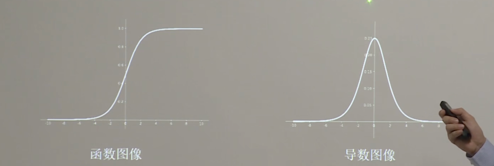
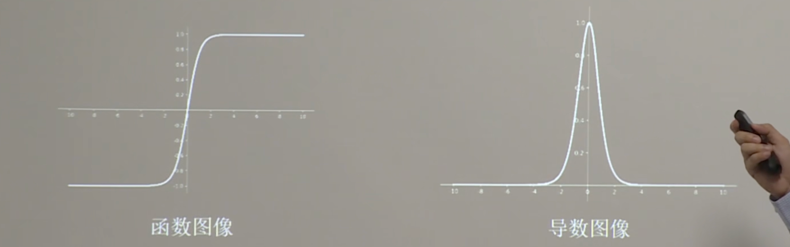
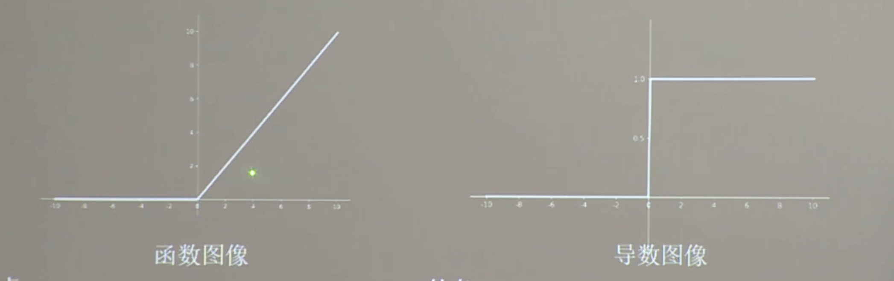
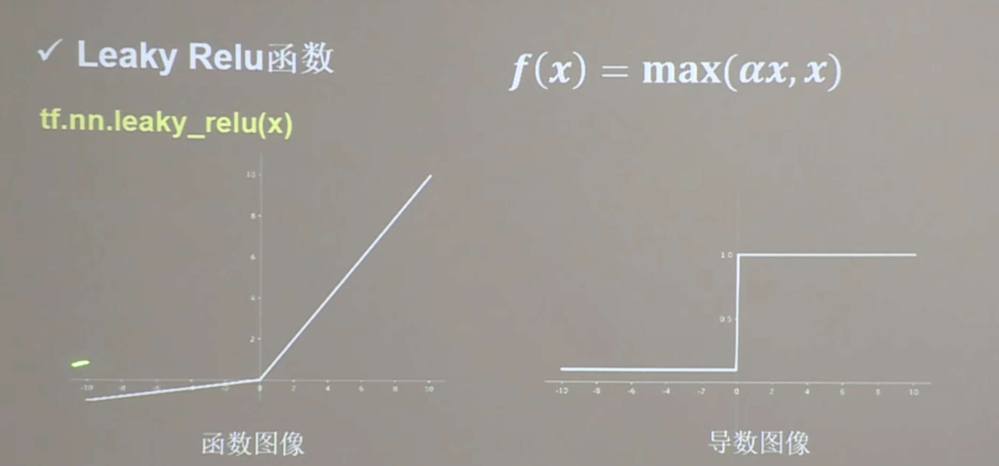

# 指数衰减学习率


```python
import tensorflow as tf
# 指数衰减学习率
# 指数衰减学习率 = 初始学习率 * 学习率衰减率 ^ (当前轮次 / 多少轮衰减一次)
w = tf.Variable(tf.constant(5, dtype=tf.float32))
epoch = 40
# 最初学习率
LR_BASE = 0.2
# 学习率衰减率
LR_DECAY = 0.99
# 喂了多少轮BATCH_SIZE后，更新一次学习率
LR_STEP = 1

# 定义epoch顶层循环，表示对数据集循环epoch次
for epoch in range(epoch):
    # lr 学习率随着epoch的变化不断的衰减
    lr = LR_BASE * LR_DECAY ** (epoch / LR_STEP)
    
    # with 开启一个GradientTape()的上下文，该上下文会监控在它之下的所有计算活动
    with tf.GradientTape() as tape:
        # 定义loss函数
        loss = tf.square(w + 1)
    # 使用tape.gradient()来计算loss对w的求导值
    grads = tape.gradient(loss, w)

    # 使用w.assign_sub()来更新w的值
    w.assign_sub(lr * grads)
    print("After %s epoch,w is %f,loss is %f,lr is %f" % (epoch, w.numpy(), loss, lr))


```

    After 0 epoch,w is 2.600000,loss is 36.000000,lr is 0.200000
    After 1 epoch,w is 1.174400,loss is 12.959999,lr is 0.198000
    After 2 epoch,w is 0.321948,loss is 4.728015,lr is 0.196020
    After 3 epoch,w is -0.191126,loss is 1.747547,lr is 0.194060
    After 4 epoch,w is -0.501926,loss is 0.654277,lr is 0.192119
    After 5 epoch,w is -0.691392,loss is 0.248077,lr is 0.190198
    After 6 epoch,w is -0.807611,loss is 0.095239,lr is 0.188296
    After 7 epoch,w is -0.879339,loss is 0.037014,lr is 0.186413
    After 8 epoch,w is -0.923874,loss is 0.014559,lr is 0.184549
    After 9 epoch,w is -0.951691,loss is 0.005795,lr is 0.182703
    After 10 epoch,w is -0.969167,loss is 0.002334,lr is 0.180876
    After 11 epoch,w is -0.980209,loss is 0.000951,lr is 0.179068
    After 12 epoch,w is -0.987226,loss is 0.000392,lr is 0.177277
    After 13 epoch,w is -0.991710,loss is 0.000163,lr is 0.175504
    After 14 epoch,w is -0.994591,loss is 0.000069,lr is 0.173749
    After 15 epoch,w is -0.996452,loss is 0.000029,lr is 0.172012
    After 16 epoch,w is -0.997660,loss is 0.000013,lr is 0.170292
    After 17 epoch,w is -0.998449,loss is 0.000005,lr is 0.168589
    After 18 epoch,w is -0.998967,loss is 0.000002,lr is 0.166903
    After 19 epoch,w is -0.999308,loss is 0.000001,lr is 0.165234
    After 20 epoch,w is -0.999535,loss is 0.000000,lr is 0.163581
    After 21 epoch,w is -0.999685,loss is 0.000000,lr is 0.161946
    After 22 epoch,w is -0.999786,loss is 0.000000,lr is 0.160326
    After 23 epoch,w is -0.999854,loss is 0.000000,lr is 0.158723
    After 24 epoch,w is -0.999900,loss is 0.000000,lr is 0.157136
    After 25 epoch,w is -0.999931,loss is 0.000000,lr is 0.155564
    After 26 epoch,w is -0.999952,loss is 0.000000,lr is 0.154009
    After 27 epoch,w is -0.999967,loss is 0.000000,lr is 0.152469
    After 28 epoch,w is -0.999977,loss is 0.000000,lr is 0.150944
    After 29 epoch,w is -0.999984,loss is 0.000000,lr is 0.149434
    After 30 epoch,w is -0.999989,loss is 0.000000,lr is 0.147940
    After 31 epoch,w is -0.999992,loss is 0.000000,lr is 0.146461
    After 32 epoch,w is -0.999994,loss is 0.000000,lr is 0.144996
    After 33 epoch,w is -0.999996,loss is 0.000000,lr is 0.143546
    After 34 epoch,w is -0.999997,loss is 0.000000,lr is 0.142111
    After 35 epoch,w is -0.999998,loss is 0.000000,lr is 0.140690
    After 36 epoch,w is -0.999999,loss is 0.000000,lr is 0.139283
    After 37 epoch,w is -0.999999,loss is 0.000000,lr is 0.137890
    After 38 epoch,w is -0.999999,loss is 0.000000,lr is 0.136511
    After 39 epoch,w is -0.999999,loss is 0.000000,lr is 0.135146


# 激活函数
## sigmoid函数

sigmoid 函数 f（x） = 1 / (1 + e^-x)

在 tf 库中，使用 tf.sigmoid(x) 函数即可实现 sigmoid 函数

sigmoid函数图像：



特点：
- 易造成梯度消失
- 输出非0均值，收敛慢
- 幂运算复杂，计算量大，训练时间长


sigmoid为什么易造成梯度消失？
- 范围问题：Sigmoid 函数会将输入值压缩到  (0, 1)  的范围，大部分值远离 0（中心），使梯度趋近于 0。
- 导数过小：Sigmoid 的导数最大值只有 0.25（当  x = 0  时），而大多数情况下导数更小。
- 链式效应：小梯度累积到深层网络会导致梯度消失问题。
    - 什么是梯度消失？ 
        - 训练神经网络时，前面的层因为‘信号变弱’，导致后面的层无法得到足够的信息，从而造成梯度消失。

为什么输出非0均值，收敛慢？
- 什么是为0均值？
    - 当网络的一层输出不是以0为中心，而是偏向某个正数或负数时，称为输出非0均值。也就是说，这层输出的值不平衡，大多数偏离了0.
- 为什么收敛慢？
    - 输出非0均值时，梯度不均衡，方向难找
        - 比如：想象在一个高低起伏的山谷（损失函数的图形）里开车找山谷底（最优点），如果车总是被推向某一边（因为非0均值导致梯度偏向一边），就很难找到正确的下降方向。 


## Tanh函数 

Tanh函数 f(x) = 1 - e^(-2x) / 1 + e^(-2x)

在tf库中，我们可以直接调用tf.tanh()函数来计算tanh函数的值。

tanh图像：


特点：
- 输出是0均值
- 易造成梯度消失
- 幂运算复杂，训练时间长

什么是0均值？
- 在神经网络中，神经元的输出值是0均值，即输出值与输入值的平均值是0。

为什么Tanh函数输出是0均值？
- Tanh 函数的数学特性（关于原点对称）使得它的输出天然是 0 均值。正因为如此，Tanh 在某些场景下比 Sigmoid 更适合深度学习，因为它能帮助梯度在正负两侧更均衡地传播。

为什么Tanh函数易造成梯度消失？
- Tanh 函数在输入很大或很小时输出接近于饱和状态，导数趋近于 0，导致梯度在反向传播中逐层衰减，从而造成梯度消失。
- Tanh 函数输出范围为 (-1, 1)，因此当输入值很大时，输出值接近于 -1 或 1，梯度几乎为 0，造成梯度消失。

## Relu函数

Relu函数  : $f(x) = max(0, x)$
$$
f(x) =
\begin{cases} 
x, & \text{if } x > 0 \\
0, & \text{if } x \leq 0
\end{cases}
$$

在tf中，可以使用tf.nn.relu()函数来计算Relu函数。
函数图像：



优点：
1. 解决了梯度消失问题(在正区间)
2. 只需要判断输入是否大于0，计算速度快
3. 收敛速度远快于sigmoid函数 和 tanh函数

缺点：
1. 输出非0均值，收敛慢
2. 存在Read ReLU 问题,某些神经元肯呢个会永远“死”掉，导致相应的参数永远不会被更新

为什么Relu函数在正区间解决了梯度消失问题呢？
- 因为当x>0时，f(x)=x，梯度为1，和sigmoid和tanh的“饱和”区不同，所以梯度不会消失。

梯度消失的本质：
- 梯度消失发生在深度神经网络中，原因是激活函数的导数太小。当我们使用链式法则计算梯度时，每一层的梯度被上层的导数相乘，如果导数接近 0，梯度会指数级衰减，最终几乎消失。

为什么Relu函数存在Read ReLU 问题呢？
- 当输入值始终为0时，某些神经元永远不会激活，导致相应的参数永远不会被更新。


## Leaky Relu函数

Leaky Relu函数 : $f(x) = max(\alpha * x, x)$

在tf中，可以使用tf.nn.leaky_relu函数实现Leaky Relu函数。

Leaky Relu函数图像：


理论上说，Leaky Relu函数有Relu 函数的优点，同时也有Relu函数没有的特性。并且不会有Dying Relu问题。

但实际操作中，Leaky Relu函数在深度学习中并不常用。

## 激活函数使用建议

- 首选relu 激活函数
- 学习率设置较小值
- 输入特征标准化，即让输入特征满足以0为均值，1为标准差的正态分布
- 初始化参数中心化，即让随机生成的参数满足以0为均值，以 $\sqrt{\frac{2}{n}}$ 为标准差的正态分布（n为当前层输入特征个数）


为什么首选relu激活函数？
1. 计算简单，效率高  $f(x)=max(0,x)$
2. 梯度不等于0，不会出现梯度消失问题(当 $x$ > 0时，$f'(x) = 1$ 可以在正区间有效传播梯度，避免梯度消失问题 )
3. 训练速度快，收敛快
4. 容易理解，实现时只需要判断 $x$ 是否大于0即可


为什么学习率设置较小值？
1. 梯度下降时，学习率过大会导致梯度爆炸，即梯度值过大，无法正常更新参数，导致模型无法收敛
2. 梯度下降时，学习率过小会导致梯度消失，即梯度值过小，无法正常更新参数，导致模型无法收敛
3. 梯度下降时，学习率过大会导致梯度消失，即梯度值过小，无法正常更新参数，导致模型无法收敛

为什么需要输入特征标准化？
1. 输入特征标准化后，可以加快模型收敛速度
    - 比喻：如果特征的尺度差异很大，就像跑步者在不同高度的坡道上跑步，速度会受到地形的影响。标准化后的特征就像是在平坦的跑道上，大家跑得差不多快。
2. 在没有标准化的情况下，某些尺度较大的特征可能对模型有更大的影响，而其他特征的影响较小。
3. 避免数值不稳定 (当特征值过大时，梯度更新步长过小，可能导致参数更新缓慢甚至不更新)

为什么需要初始化参数中心化？
1. 避免对称性问题
    - 对称性问题：如果所有参数在初始化时都取相同的值，那么参数更新后所有的参数都会取相同的值，从而无法有效学习到不同特征的信息。
2. 初始化中心化的作用
    - 通过初始化时是参数满足以0为均值，可以打破对称性，让参数在训练时能够学习到不同特征的信息
3. 加速模型收敛


# 损失函数

损失函数（loss） ： 预测值(y)与真实值(y_)之间的误差

NN优化目标 : loss最小化 --> 
-  mes(Mean Squared Error)
-  cust(Custom Loss)
-  ce(Cross Entropy)

## 均方误差mse 

均方误差mse ： MSE(y_, y) = $ \frac {1} {n} \sum\limits _ {i = 1} ^ n（y\_-y）^2$

在tensoflow中计算均方误差mse的函数是
```
loss_mse =  tf.reduce_mean(tf.square(y_ - y))
```


均方误差demo

预测酸奶日销量y, x1,x2是影响日销量的因素。

建模前，应预先采集的数据有：每日x1, x2值，以及真实的销量y_值。 （最佳情况，产量=销量）
拟造数据集 X,Y_ = y_ = x1 + x2 噪音：-0.05~0.05 拟合模型可以预测销量的函数


```python
import numpy as np
import tensorflow as tf

# random seed ,确保每次运行的结果都相同
SEED = 23455

# 定义获取随机数种子的函数
rdm = np.random.RandomState(seed = SEED)
x = rdm.rand(32,2)

# 通过列表推导式生成 y_(真实值)
# [expression for item in iterable] 列表推导式
# 这段代码会遍历 iterable 中的每一个 item，对每个 item 执行 expression，并将结果放入新列表。
# 【for (x1,x2) in x】 中 (x1, x2) 表示解包每个二元组，把每个二元组的第一个元素赋值给 x1，第二个元素赋值给 x2
# 【x1 + x2 + (rdm.rand() / 10.0 - 0.05)】 表示对于每一对二元组，计算 x1 + x2 + (随机噪声)
# 通过列表推导式，y_ 最终将是一个包含多个子列表的列表，每个子列表包含一个预测值（x1 + x2 + (随机噪声)）
y_ = [[x1 + x2 + (rdm.rand() / 10.0 - 0.05)] for (x1,x2) in x]

# print(f'x = {x}')
# print(f'y_ = {y_}')

# 对x 进行类型转换 确保x 的类型为 float32
x = tf.cast(x, dtype = tf.float32)

# 定义权重
w1 = tf.Variable(tf.random.normal([2,1], stddev = 0.01,seed = 1), name = 'weights')

# 定义循环次数和学习率
epoch = 15000
lr = 0.002


for epoch in range(epoch):
    with tf.GradientTape() as tape:
        y = tf.matmul(x, w1)
        loss = tf.reduce_mean(tf.square(y_ - y))
        
    grads = tape.gradient(loss,w1)
    w1.assign_sub(lr * grads)
    
    if epoch % 500 == 0:
        print("After %d training steps,w1 is " % (epoch))
        print(w1.numpy(), "\n")
print("Final w1 is: ", w1.numpy())    


```

    After 0 training steps,w1 is 
    [[-0.00606132]
     [ 0.01711569]] 
    
    After 500 training steps,w1 is 
    [[0.6230188]
     [0.7028614]] 
    
    After 1000 training steps,w1 is 
    [[0.84193623]
     [0.9267406 ]] 
    
    After 1500 training steps,w1 is 
    [[0.9216611]
     [0.996582 ]] 
    
    After 2000 training steps,w1 is 
    [[0.95350116]
     [1.0156252 ]] 
    
    After 2500 training steps,w1 is 
    [[0.9683416]
     [1.0183938]] 
    
    After 3000 training steps,w1 is 
    [[0.97672486]
     [1.0163445 ]] 
    
    After 3500 training steps,w1 is 
    [[0.98232806]
     [1.0132076 ]] 
    
    After 4000 training steps,w1 is 
    [[0.986496 ]
     [1.0101532]] 
    
    After 4500 training steps,w1 is 
    [[0.9897705]
     [1.0074826]] 
    
    After 5000 training steps,w1 is 
    [[0.992408 ]
     [1.0052363]] 
    
    After 5500 training steps,w1 is 
    [[0.99455494]
     [1.0033753 ]] 
    
    After 6000 training steps,w1 is 
    [[0.99631053]
     [1.001843  ]] 
    
    After 6500 training steps,w1 is 
    [[0.99774885]
     [1.0005844 ]] 
    
    After 7000 training steps,w1 is 
    [[0.99892753]
     [0.9995504 ]] 
    
    After 7500 training steps,w1 is 
    [[0.99989456]
     [0.998702  ]] 
    
    After 8000 training steps,w1 is 
    [[1.0006859 ]
     [0.99800646]] 
    
    After 8500 training steps,w1 is 
    [[1.001336 ]
     [0.9974357]] 
    
    After 9000 training steps,w1 is 
    [[1.0018682 ]
     [0.99696827]] 
    
    After 9500 training steps,w1 is 
    [[1.0023079 ]
     [0.99658436]] 
    
    After 10000 training steps,w1 is 
    [[1.0026675]
     [0.9962691]] 
    
    After 10500 training steps,w1 is 
    [[1.0029615]
     [0.9960131]] 
    
    After 11000 training steps,w1 is 
    [[1.0031999 ]
     [0.99580085]] 
    
    After 11500 training steps,w1 is 
    [[1.00339  ]
     [0.9956305]] 
    
    After 12000 training steps,w1 is 
    [[1.0035625]
     [0.995485 ]] 
    
    After 12500 training steps,w1 is 
    [[1.0036817 ]
     [0.99537015]] 
    
    After 13000 training steps,w1 is 
    [[1.0038009 ]
     [0.99528074]] 
    
    After 13500 training steps,w1 is 
    [[1.0038806]
     [0.9951989]] 
    
    After 14000 training steps,w1 is 
    [[1.0039402]
     [0.9951393]] 
    
    After 14500 training steps,w1 is 
    [[1.0039998]
     [0.995087 ]] 
    
    Final w1 is:  [[1.0040593 ]
     [0.99504954]]


## 自定义损失函数

**自定义损失函数**
预测商品销量，预测多了，损失成本，预测少了，损失利润。

若利润不等于成本，则mse产生的loss无法利益最大化

自定义损失函数 loss(y_, y) = f(y_, y)

f(y, y_) = y < y_ : PROFIT * (y_ - y)  # 预测的y值比真实值小，则损失为利润 * (真实值 - 预测值)

f(y, y_) = y > y_ : COST * (y - y_)  # 预测的y值比真实值大，则损失为成本 * (预测值 - 真实值)

loss_zdy = tf.reduce_mean(tf.where(tf.greater(y, y_), COST * (y - y_), PROFIT * (y_ - y)))

如：
预测酸奶效率，酸奶成本COST 为1元，酸奶利润PROFIT 为99元

预测少了损失利润99元，大于预测多了损失成本1元

预测少了损失大，希望生成的预测函数往多了预测


```python
# 使用自定义损失函数

import numpy as np
import tensorflow as tf

# random seed ,确保每次运行的结果都相同
SEED = 23455

# 定义获取随机数种子的函数
rdm = np.random.RandomState(seed = SEED)
x = rdm.rand(32,2)

# 通过列表推导式生成 y_(真实值)
# [expression for item in iterable] 列表推导式
# 这段代码会遍历 iterable 中的每一个 item，对每个 item 执行 expression，并将结果放入新列表。
# 【for (x1,x2) in x】 中 (x1, x2) 表示解包每个二元组，把每个二元组的第一个元素赋值给 x1，第二个元素赋值给 x2
# 【x1 + x2 + (rdm.rand() / 10.0 - 0.05)】 表示对于每一对二元组，计算 x1 + x2 + (随机噪声)
# 通过列表推导式，y_ 最终将是一个包含多个子列表的列表，每个子列表包含一个预测值（x1 + x2 + (随机噪声)）
y_ = [[x1 + x2 + (rdm.rand() / 10.0 - 0.05)] for (x1,x2) in x]

# print(f'x = {x}')
# print(f'y_ = {y_}')

# 对x 进行类型转换 确保x 的类型为 float32
x = tf.cast(x, dtype = tf.float32)

# 定义权重
w1 = tf.Variable(tf.random.normal([2,1], stddev = 0.01,seed = 1), name = 'weights')

# 定义循环次数和学习率
epoch = 15000
lr = 0.002

COST = 1
PROFIT = 99


for epoch in range(epoch):
    with tf.GradientTape() as tape:
        y = tf.matmul(x, w1)
        # y : 预测值  y_ : 真实值
        # 如果 y > y_ 说明预测值大于真实值，则损失为 COST * (y - y_)
        # 如果 y < y_ 说明预测值小于真实值，则损失为 PROFIT * (y - y_)
        loss = tf.reduce_mean(tf.where(tf.greater(y, y_,), COST * (y - y_), PROFIT * (y_ - y)))
        
    grads = tape.gradient(loss,w1)
    w1.assign_sub(lr * grads)
    
    if epoch % 500 == 0:
        print("After %d training steps,w1 is " % (epoch))
        print(w1.numpy(), "\n")
        
# 因为预测的少时，损失更多，所以预测值会偏大，w1 最终会偏大 结果都大于1
print("Final w1 is: ", w1.numpy())    


```

    After 0 training steps,w1 is 
    [[0.10785456]
     [0.10605892]] 
    
    After 500 training steps,w1 is 
    [[1.1292225]
     [1.0316375]] 
    
    After 1000 training steps,w1 is 
    [[1.1289185]
     [1.0326198]] 
    
    After 1500 training steps,w1 is 
    [[1.1286144]
     [1.0336021]] 
    
    After 2000 training steps,w1 is 
    [[1.1283102]
     [1.0345844]] 
    
    After 2500 training steps,w1 is 
    [[1.1280059]
     [1.0355667]] 
    
    After 3000 training steps,w1 is 
    [[1.1288835]
     [1.0313871]] 
    
    After 3500 training steps,w1 is 
    [[1.1285794]
     [1.0323694]] 
    
    After 4000 training steps,w1 is 
    [[1.1282754]
     [1.0333517]] 
    
    After 4500 training steps,w1 is 
    [[1.1279712]
     [1.034334 ]] 
    
    After 5000 training steps,w1 is 
    [[1.1294996]
     [1.0356691]] 
    
    After 5500 training steps,w1 is 
    [[1.1285448]
     [1.0311366]] 
    
    After 6000 training steps,w1 is 
    [[1.1282402]
     [1.0321189]] 
    
    After 6500 training steps,w1 is 
    [[1.1279364]
     [1.0331012]] 
    
    After 7000 training steps,w1 is 
    [[1.1276323]
     [1.0340835]] 
    
    After 7500 training steps,w1 is 
    [[1.1291605]
     [1.0354186]] 
    
    After 8000 training steps,w1 is 
    [[1.1288564]
     [1.0364009]] 
    
    After 8500 training steps,w1 is 
    [[1.1279019]
     [1.0318685]] 
    
    After 9000 training steps,w1 is 
    [[1.1275975]
     [1.0328507]] 
    
    After 9500 training steps,w1 is 
    [[1.1291258]
     [1.0341859]] 
    
    After 10000 training steps,w1 is 
    [[1.1288217]
     [1.0351682]] 
    
    After 10500 training steps,w1 is 
    [[1.1285177]
     [1.0361505]] 
    
    After 11000 training steps,w1 is 
    [[1.1275629]
     [1.031618 ]] 
    
    After 11500 training steps,w1 is 
    [[1.1290914]
     [1.0329531]] 
    
    After 12000 training steps,w1 is 
    [[1.1287872]
     [1.0339354]] 
    
    After 12500 training steps,w1 is 
    [[1.1284829]
     [1.0349177]] 
    
    After 13000 training steps,w1 is 
    [[1.1300106]
     [1.0362529]] 
    
    After 13500 training steps,w1 is 
    [[1.1290561]
     [1.0317204]] 
    
    After 14000 training steps,w1 is 
    [[1.1287519]
     [1.0327027]] 
    
    After 14500 training steps,w1 is 
    [[1.1284481]
     [1.033685 ]] 
    
    Final w1 is:  [[1.1284901]
     [1.0353786]]


## 交叉熵损失函数

交叉熵损失函数CE(Cross Entropy): 表征俩个概率分布之间的差异，常用于多分类问题。

$  H(y\_,y) = - \sum y\_ * ln(y) $

eg: 二分类。已知答案y_=(1,0) , 预测y1=(0.6,0.4), y2=(0.8,0.2),哪个更接近答案？

H1 = -1*ln(0.6) - 0*ln(0.4) = 0.51

H2 = -1*ln(0.8) - 0*ln(0.2) = 0.223

因为H1 > H2, 所以y2更接近答案

在 TensorFlow中 ，**tf.losses.categorical_crossentropy() 函数可以计算交叉熵损失。**


```python
y_ = tf.constant([1.0, 0.0])
y1 = tf.constant([0.6, 0.4])
y2 = tf.constant([0.8, 0.2])

loss_y1 = tf.losses.categorical_crossentropy(y_, y1)
loss_y2 = tf.losses.categorical_crossentropy(y_, y2)
print(f'loss_y1: {loss_y1}')
print(f'less_y2: {loss_y2}')
```

    loss_y1: 0.5108255743980408
    less_y2: 0.2231435328722


### softmax与交叉熵结合

输出先通过softmax函数进行归一化，再计算y 与 y_的交叉熵损失函数。

在 TensorFlow 中，计算交叉熵损失函数的方法为：
```python
cross_entropy = tf.reduce_mean(tf.nn.softmax_cross_entropy_with_logits(labels=y_, logits=y))
```

什么是softmax函数？

softmax函数是一种将多个数映射到0-1之间的函数，其作用是将输入的实数变换为非负数，并且所有值之和为1，因此可以直接将输出理解为概率分布。。


```python
y_ = tf.constant([[1,0,0],[0,1,0],[0,0,1],[1,0,0],[0,0,1]])
y = tf.constant([[12,3,2],[3,10,1],[1,2,5],[4,6.5,1.2],[3,6,1]])

y_pro = tf.nn.softmax(y)

loss_ce1 = tf.losses.categorical_crossentropy(y_, y_pro)
loss_ce2 = tf.nn.softmax_cross_entropy_with_logits(y_, y)

print(f'loss_ce1 分步计算结果 : {loss_ce1}')

print(f'loss_ce2 组合计算结果 : {loss_ce2}')
```

    loss_ce1 分步计算结果 : [1.6881460e-04 1.0347950e-03 6.5883920e-02 2.5834920e+00 5.0549855e+00]
    loss_ce2 组合计算结果 : [1.6878611e-04 1.0346782e-03 6.5883912e-02 2.5834920e+00 5.0549850e+00]

