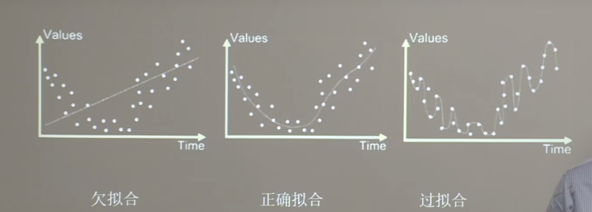
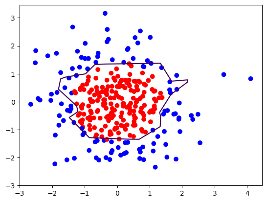
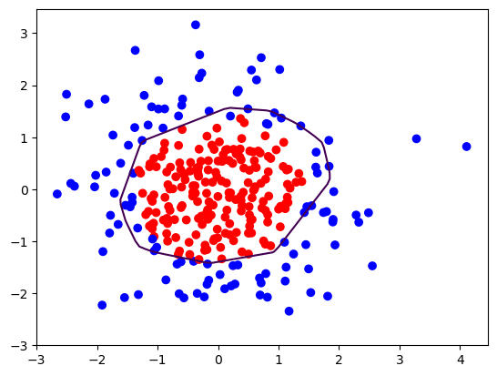

# 欠拟合和过拟合

**欠拟合与过拟合**




**什么是欠拟合与过拟合？**
  - 欠拟合：当训练数据集上的拟合效果很好，但泛化效果很差。
  - 过拟合：当训练数据集上的拟合效果很好，但泛化效果很好。


**欠拟合的解决方法:**
- 增加输入特征项
- 增加网络参数
- 减少正则化参数

**过拟合的解决方法:**
- 数据清洗
- 增大训练集
- 采用正则化
- 增大正则化参数

**为什么增加输入特征项和增加网络参数可以解决欠拟合问题？**
- 欠拟合的原因：欠拟合是指模型的表现不够好，无法很好的捕捉训练数据中的模式，导致在训练集和测试集上都表现很差
  1. 模型的容量不足（比如参数太少，无法表示复杂的关系）
	2. 特征不足（输入数据无法充分反映问题的本质）。
	3. 训练不足（训练轮次少或优化问题）。
	4. 模型选择不当（如线性模型处理非线性问题）。
- 增加输入特征性如何帮助解决欠拟合问题？
  1. 丰富信息，增加重要的特征提升模型的表达能力
  2. 减少偏差，模型可能因为特征不够而受到限制，增加特征后可以提升模型的表现
  3. 对于简单的模型，比如线性回归，增加多项式特征或交互特征能让模型学习更复杂的关系
- 增加网络参数如何帮助解决欠拟合问题？
  1. 提升模型容量，增加参数可以提升模型的表达能力
  2. 减少偏差，增加参数后可以提升模型的表现

**为什么减少正则化参数可以解决欠拟合问题？**
- 正则化的作用：正则化的目的是限制模型的复杂度，防止它咋训练数据上过于灵活，导致无法泛化到测试数据上
  1. L1正则化：鼓励权重参数的稀疏性，即让一些权重参数为0，自动选择特征
  2. L2正则化: 限制权重的大小，让模型更加平滑。
  3. Dropout正则化：在训练过程中，随机丢弃一部分神经元，让模型更加泛化，防止过拟合。
- 正则化的强弱由参数 $\lambda$ 控制
  1. $\lambda$ 越大，正则化越强，模型越简单，可能导致欠拟合
  2. $\lambda$ 越小，正则化越弱，模型越复杂，可能导致过拟合
- 通过减少正则化参数可以解决欠拟合问题：
  1. 放宽限制：减少正则化后，模型可以允许更大的权重，从而更灵活地拟合数据。
	2. 增加复杂度：模型容量会变大，可以学习训练数据中更复杂的模式。
	3. 减少约束误差：过强的正则化会把模型逼得太“简单”，降低其拟合能力，减少正则化让它更加贴合数据。


**为什么采用正则化可以解决过拟合问题？（增大正则化参数）**

正则化通过在损失函数中加入惩罚项，限制模型的复杂度，使模型更倾向于学习数据的全局模式，而不是记住训练集的细节
- L1正则化（Lasso）：将权重的绝对值之和作为惩罚项，使一些权重变为0，从而实现特征选择。

	•	惩罚项：$\lambda \sum_{i=1}^n |w_i|$
-	L2正则化（Ridge）：将权重的平方和作为惩罚项，压缩权重的大小，使模型更平滑。

	•	惩罚项：$\lambda \sum_{i=1}^n w_i^2$
- Elastic Net：结合L1和L2正则化，既能稀疏化权重，又能限制权重大小。


**为什么增大训练集可以解决过拟合问题？**
- 减少噪声的影响：训练集较小时，模型可能会“记住”训练数据中的特定细节或噪声，而不是学习数据的整体模式。
  1. 更多样本会提供更全面的特征分布，降低噪声对模型的影响
  2. 模型更倾向学习普遍的规律，而非记住训练数据中的随机特性
- 更准确的逼近真实分布：训练集不足时，模型学到的分布可能偏离数据的真实分布。
  1. 增加数据量后，训练数据更接近真实分布，模型可以更准确地拟合数据
  2. 训练集的多样性提高后，模型在测试集上表现更好
- 平滑损失曲线：训练集不足时，模型可能会学习到过拟合的局部最小值。
  1. 增加数据后，模型可以学习到更平滑的损失曲线
  2. 模型更容易找到全局最优解，而不是陷入局部最优解
- 增加泛化能力
- 数据增强的类似效果


# 正则化缓解过拟合

正则化在损失函数中引入模型复杂度指标，利用给$w$加权值，弱化了训练数据的噪声（一般不正则化$b$）

$loss = loss(y与y\_) + REGULARIZER * loss(w)$

$loss(y与y\_)$ : 模型中所有参数的损失函数：如：交叉熵损失函数、均方差损失函数等

$REGULARIZER * loss(w)$ : 用超参数REGULARIZER给出参数$w$ 在总loss中的比例，即正则化的权重

$w$ 需要正则化的参数，如：全连接层中的权重矩阵$w$、卷积层中的权重矩阵$w$、池化层中的权重矩阵$w$等。

**正则化的选择**：
- L1正则化（Lasso）：将权重的绝对值之和作为惩罚项，使一些权重变为0，从而实现特征选择。因此该方法可通过稀释参数，减少参数的数据，降低模型复杂度，减少过拟合的风险。

	•	惩罚项：$\lambda \sum_{i=1}^n |w_i|$
-	L2正则化（Ridge）：将权重的平方和作为惩罚项，压缩权重的大小，使模型更平滑。因此该方法可通过减少参数的大小降低模型复杂度，减少过拟合的风险。

	•	惩罚项：$\lambda \sum_{i=1}^n w_i^2$


**在TensorFlow中实现正则化缓解过拟合**
```python

import tensorflow as tf
# 记录梯度信息
with tf.GradientTape() as tape:
    # 记录神经网络结构
    h1 = tf.matmul(x_train, w1) + b1
    h1 = tf.nn.relu(h1)
    y = tf.matmul(h1, w2) + b2
    
    # 采用均方误差损失函数计算损失
    loss_mse = tf.reduce_mean(tf.square(y - y_train))
    
    # 添加正则化项
    loss_regularization = []
    loss_regularization.append(tf.nn.l2_loss(w1))
    loss_regularization.append(tf.nn.l2_loss(w2))
    loss_regularization = tf.reduce_sum(loss_regularization)
    loss = loss_mse + 0.03 * loss_regularization

# 计算loss对参数的梯度信息
variables = [w1, b1, w2, b2]
grads = tape.gradient(loss, variables) 
	
```

# 正则化缓解过拟合 Demo (不使用正则化时)


```python
import tensorflow as tf
from matplotlib import pyplot as plt
import numpy as np
import pandas as pd

# 读取数据/标签 生成x_train, y_train
df = pd.read_csv('dot.csv')
x_data = np.array(df[['x1', 'x2']])
y_data = np.array(df['y_c'])

print(f'x_data: {x_data[:5]}')
print(f'y_data: {y_data[:5]}')
print(f'x_data shape: {x_data.shape}')
print(f'y_data shape: {y_data.shape}')

# np.vstack函数将x_data的数据进行堆叠，单独使用时等同于直接返回原数组
# reshape(-1, 2) 参数-1表示该维度的大小有系统自动计算，参数2表示每行包括2列数据
x_train = np.vstack(x_data).reshape(-1, 2)
print(f'x_train: {x_train[:5]}')
print(f'x_train shape: {x_train.shape}')
# np.vstack函数将y_data的数据进行堆叠，单独使用时等同于直接返回原数组
# reshape(-1, 1) 参数-1表示该维度的大小有系统自动计算，参数1表示每行包括1列数据
y_train = np.vstack(y_data).reshape(-1, 1)
print(f'y_train: {y_train[:5]}')
print(f'y_train shape: {y_train.shape}')

# 转换数据类型,确保矩阵相乘时不会因为数据类型不同而报错
x_train = tf.cast(x_train, tf.float32)
y_train = tf.cast(y_train, tf.float32)

Y_c = [['red' if y else 'blue'] for y in y_train]


# from_tensor_slices函数将数据转换为tf.data.Dataset对象,使输入特征和标签对应起来，batch参数表示每次取32个数据
# 生成的 redata 是一个 Dataset 对象，其中每一条记录是一个元组 (x[i], y[i])，可以被迭代使用。
train_db = tf.data.Dataset.from_tensor_slices((x_train, y_train)).batch(32)
```

    x_data: [[-0.41675785 -0.05626683]
     [-2.1361961   1.64027081]
     [-1.79343559 -0.84174737]
     [ 0.50288142 -1.24528809]
     [-1.05795222 -0.90900762]]
    y_data: [1 0 0 1 1]
    x_data shape: (300, 2)
    y_data shape: (300,)
    x_train: [[-0.41675785 -0.05626683]
     [-2.1361961   1.64027081]
     [-1.79343559 -0.84174737]
     [ 0.50288142 -1.24528809]
     [-1.05795222 -0.90900762]]
    x_train shape: (300, 2)
    y_train: [[1]
     [0]
     [0]
     [1]
     [1]]
    y_train shape: (300, 1)


```python
# 定义神经网络的结构
# 生成神经网络的参数，输入层为2个神经元，隐藏层为10个神经元，输出层为1个神经元
# 使用tf.Variable函数将参数设置为可训练的
# w1 是输入层到隐藏层的权重，b1 是输入层到隐藏层的偏置 
# w1 的形状是[2, 10]，因为输入层有2个神经元，隐藏层有10个神经元，所以形状是 [2, 10]
# b1 的形状是 [10]，因为隐藏层有10个神经元，每个神经元需要一个偏置值 所以形状是 [10]
w1 = tf.Variable(tf.random.normal([2, 10]),dtype = tf.float32)
b1 = tf.Variable(tf.constant(0.01,shape=[10]))

# w2 是隐藏层到输出层的权重，b2 是隐藏层到输出层的偏置 
# w2 的形状是[10, 1]，因为隐藏层有10个神经元，输出层有1个神经元，所以形状是 [10, 1]
# b2 的形状是 [1]，因为输出层有1个神经元，每个神经元需要一个偏置值 所以形状是 [1]
w2 = tf.Variable(tf.random.normal([10, 1]),dtype = tf.float32)
b2 = tf.Variable(tf.constant(0.01,shape=[1]))

# 定义参数
# 学习率
lr = 0.01
# 迭代次数
epoch = 400

# 训练模型
for epoch in range(epoch):
    for step , (x_train, y_train) in enumerate(train_db):
        # 记录梯度信息
        with tf.GradientTape() as tape:
            # 计算神经网络输出
            # 输入层到隐藏层的计算
            h1 = tf.matmul(x_train, w1) + b1
            # 设置relu激活函数，h1是输入层到隐藏层的输出
            h1 = tf.nn.relu(h1)
            # 隐藏层到输出层的计算
            y = tf.matmul(h1, w2) + b2
            
            # 采用均方误差函数mse = mean(sum(y-out)^2)
            loss = tf.reduce_mean(tf.square(y_train - y))
        # 计算loss对各个参数的梯度
        variables = [w1, b1, w2, b2]
        grads = tape.gradient(loss, variables)
        
        # 实现梯度下降
        # w1 = w1 - lr * w1_grad tape.gradient是自动求导结果 与[w1,w2,b1,b2]的对应关系 索引为0,1,2,3
        w1.assign_sub(lr * grads[0])
        b1.assign_sub(lr * grads[1])
        w2.assign_sub(lr * grads[2])
        b2.assign_sub(lr * grads[3])
    if epoch % 20 == 0:
        print("epoch: ", epoch, "loss: ", float(loss))

```

    epoch:  0 loss:  1.100724697113037
    epoch:  20 loss:  0.0589074082672596
    epoch:  40 loss:  0.04113192856311798
    epoch:  60 loss:  0.03670873865485191
    epoch:  80 loss:  0.03495822846889496
    epoch:  100 loss:  0.034126877784729004
    epoch:  120 loss:  0.03336574509739876
    epoch:  140 loss:  0.03255508467555046
    epoch:  160 loss:  0.031949419528245926
    epoch:  180 loss:  0.03156721964478493
    epoch:  200 loss:  0.031183674931526184
    epoch:  220 loss:  0.03080463968217373
    epoch:  240 loss:  0.030441707000136375
    epoch:  260 loss:  0.029994254931807518
    epoch:  280 loss:  0.02966471016407013
    epoch:  300 loss:  0.029243240132927895
    epoch:  320 loss:  0.028849022462964058
    epoch:  340 loss:  0.028490634635090828
    epoch:  360 loss:  0.02809465490281582
    epoch:  380 loss:  0.027780652046203613


```python
# 预测部分

# 生成网格坐标点
# xx 在-3到3之间以步长为0.01 yy在-3到3之间以步长为0.01,生成间隔数值点
xx,yy = np.mgrid[ -3:3:0.01, -3:3:0.01]
print(f'xx is \n{xx}')
print(f'yy is \n{yy}')

# 将xx,yy 拉直，合并被配对为二维张量，生成二维坐标点
grid = np.c_[xx.ravel(), yy.ravel()]
print(f'grid is \n{grid}')
grid = tf.cast(grid, tf.float32)
# 将网格坐标点喂入神经网络，进行预测 ，probs为输出

# 预测
probs = []
for x_test in grid:
    # 使用模型进行预测
    h1 = tf.matmul([x_test], w1) + b1
    h1 = tf.nn.relu(h1)
    y = tf.matmul(h1, w2) + b2
    probs.append(y)


# 读入红蓝点，画出分割线，不包含正则化
# 取第0列给x1，取第1列给x2
x1 = x_data[:, 0]
x2 = x_data[:, 1]
# probs的shape调整成xx的样子
probs = np.array(probs).reshape(xx.shape)
# squeeze去掉纬度是1的纬度,相当于去掉[['red'],[''blue]],内层括号变为['red','blue']
plt.scatter(x1, x2, color=np.squeeze(Y_c))

# 把坐标xx yy和对应的值probs放入contour<[‘kɑntʊr]>函数，给probs值为0.5的所有点上色  plt点show后 显示的是红蓝点的分界线
plt.contour(xx, yy, probs, levels=[.5])
plt.show()


```

    xx is 
    [[-3.   -3.   -3.   ... -3.   -3.   -3.  ]
     [-2.99 -2.99 -2.99 ... -2.99 -2.99 -2.99]
     [-2.98 -2.98 -2.98 ... -2.98 -2.98 -2.98]
     ...
     [ 2.97  2.97  2.97 ...  2.97  2.97  2.97]
     [ 2.98  2.98  2.98 ...  2.98  2.98  2.98]
     [ 2.99  2.99  2.99 ...  2.99  2.99  2.99]]
    yy is 
    [[-3.   -2.99 -2.98 ...  2.97  2.98  2.99]
     [-3.   -2.99 -2.98 ...  2.97  2.98  2.99]
     [-3.   -2.99 -2.98 ...  2.97  2.98  2.99]
     ...
     [-3.   -2.99 -2.98 ...  2.97  2.98  2.99]
     [-3.   -2.99 -2.98 ...  2.97  2.98  2.99]
     [-3.   -2.99 -2.98 ...  2.97  2.98  2.99]]
    grid is 
    [[-3.   -3.  ]
     [-3.   -2.99]
     [-3.   -2.98]
     ...
     [ 2.99  2.97]
     [ 2.99  2.98]
     [ 2.99  2.99]]


    

    


# 正则化缓解过拟合 DEMO （使用正则化）


```python
import tensorflow as tf
from matplotlib import pyplot as plt
import numpy as np
import pandas as pd

# 读取数据
df = pd.read_csv('dot.csv')
x_data = np.array(df[['x1', 'x2']])
y_data = np.array(df['y_c'])

x_train = np.vstack(x_data).reshape(-1, 2)
y_train = np.vstack(y_data).reshape(-1, 1)
x_train = tf.cast(x_train, tf.float32)
y_train = tf.cast(y_train, tf.float32)
Y_c = [['red' if y else 'blue'] for y in y_train]

train_db = tf.data.Dataset.from_tensor_slices((x_train, y_train)).batch(32)

w1 = tf.Variable(tf.random.normal([2, 10]),dtype = tf.float32)
b1 = tf.Variable(tf.constant(0.01,shape=[10]))
w2 = tf.Variable(tf.random.normal([10, 1]),dtype = tf.float32)
b2 = tf.Variable(tf.constant(0.01,shape=[1]))

lr = 0.01
epoch = 400

# 训练模型
for epoch in range(epoch):
    for step , (x_train, y_train) in enumerate(train_db):
        with tf.GradientTape() as tape:

            h1 = tf.matmul(x_train, w1) + b1
            h1 = tf.nn.relu(h1)
            y = tf.matmul(h1, w2) + b2
            
            # 采用均方误差函数mse = mean(sum(y-out)^2)
            loss_mse = tf.reduce_mean(tf.square(y_train - y))

            # ============添加L2正则化损失函数============
            loss_regularization = []
            loss_regularization.append(tf.nn.l2_loss(w1))
            loss_regularization.append(tf.nn.l2_loss(w2))
            
            # 求和
            # 例： x = tf.constant(([1,1,1],[1,1,1]))
            # tf.reduce_sum(x) 
            # >>>> 3
            loss_regularization = tf.reduce_sum(loss_regularization)
            # Regularization = 0.03 
            loss = loss_mse + 0.03 * loss_regularization
            
            # =============添加L2正则化损失函数============

        # 计算梯度
        variables = [w1, b1, w2, b2]
        grads = tape.gradient(loss, variables)
        
        # 实现梯度下降
        # w1 = w1 - lr * w1_grad tape.gradient是自动求导结果 与[w1,w2,b1,b2]的对应关系 索引为0,1,2,3
        w1.assign_sub(lr * grads[0])
        b1.assign_sub(lr * grads[1])
        w2.assign_sub(lr * grads[2])
        b2.assign_sub(lr * grads[3])
    if epoch % 20 == 0:
        print("epoch: ", epoch, "loss: ", float(loss))


# 预测部分
print("*******predict*******")
# xx在-3到3之间以步长为0.01，yy在-3到3之间以步长0.01,生成间隔数值点
xx, yy = np.mgrid[-3:3:.1, -3:3:.1]
# 将xx, yy拉直，并合并配对为二维张量，生成二维坐标点
grid = np.c_[xx.ravel(), yy.ravel()]
grid = tf.cast(grid, tf.float32)
# 将网格坐标点喂入神经网络，进行预测，probs为输出
probs = []
for x_predict in grid:
    # 使用训练好的参数进行预测
    h1 = tf.matmul([x_predict], w1) + b1
    h1 = tf.nn.relu(h1)
    y = tf.matmul(h1, w2) + b2  # y为预测结果
    probs.append(y)

# 取第0列给x1，取第1列给x2
x1 = x_data[:, 0]
x2 = x_data[:, 1]
# probs的shape调整成xx的样子
probs = np.array(probs).reshape(xx.shape)
plt.scatter(x1, x2, color=np.squeeze(Y_c))
# 把坐标xx yy和对应的值probs放入contour<[‘kɑntʊr]>函数，给probs值为0.5的所有点上色  plt点show后 显示的是红蓝点的分界线
plt.contour(xx, yy, probs, levels=[.5])
plt.show()
```

    2024-12-04 17:27:13.573288: I tensorflow/core/common_runtime/executor.cc:1197] [/device:CPU:0] (DEBUG INFO) Executor start aborting (this does not indicate an error and you can ignore this message): INVALID_ARGUMENT: You must feed a value for placeholder tensor 'Placeholder/_1' with dtype float and shape [300,1]
    	 [[{{node Placeholder/_1}}]]


    epoch:  0 loss:  0.9712199568748474
    epoch:  20 loss:  0.5317731499671936
    epoch:  40 loss:  0.463352233171463
    epoch:  60 loss:  0.4132520854473114
    epoch:  80 loss:  0.37032660841941833
    epoch:  100 loss:  0.33302009105682373
    epoch:  120 loss:  0.30011284351348877
    epoch:  140 loss:  0.2710988223552704
    epoch:  160 loss:  0.24582086503505707
    epoch:  180 loss:  0.2228199988603592
    epoch:  200 loss:  0.20373402535915375
    epoch:  220 loss:  0.18722781538963318
    epoch:  240 loss:  0.17286401987075806
    epoch:  260 loss:  0.15997634828090668
    epoch:  280 loss:  0.14907291531562805
    epoch:  300 loss:  0.13956664502620697
    epoch:  320 loss:  0.13035735487937927
    epoch:  340 loss:  0.12258812040090561
    epoch:  360 loss:  0.11519739776849747
    epoch:  380 loss:  0.10952658951282501
    *******predict*******


    

    

